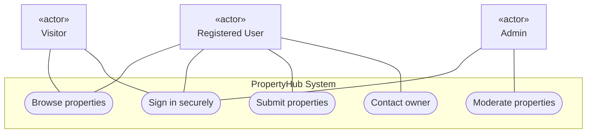
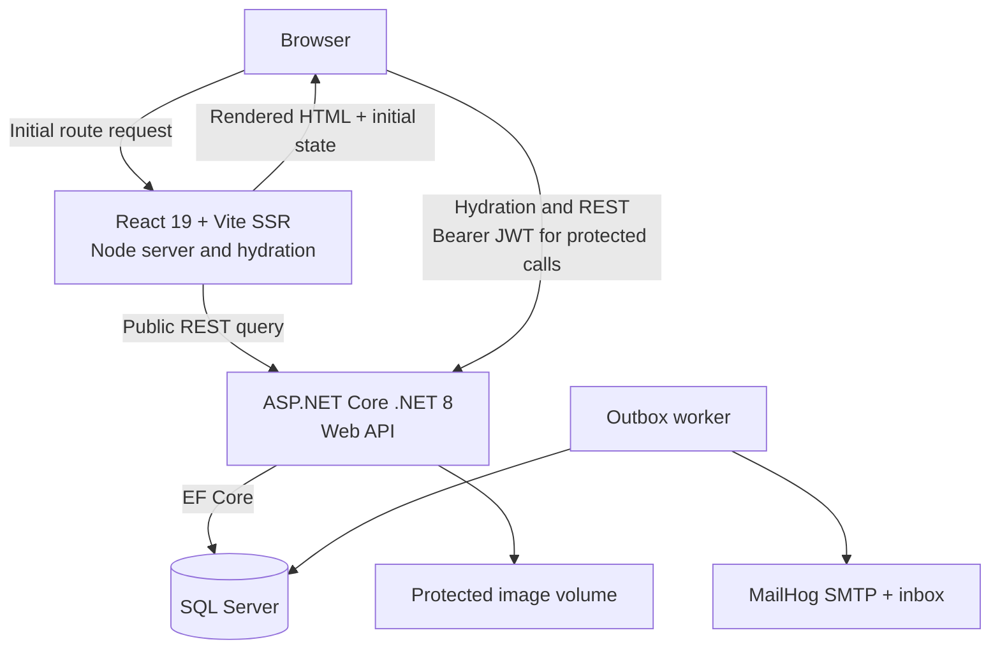
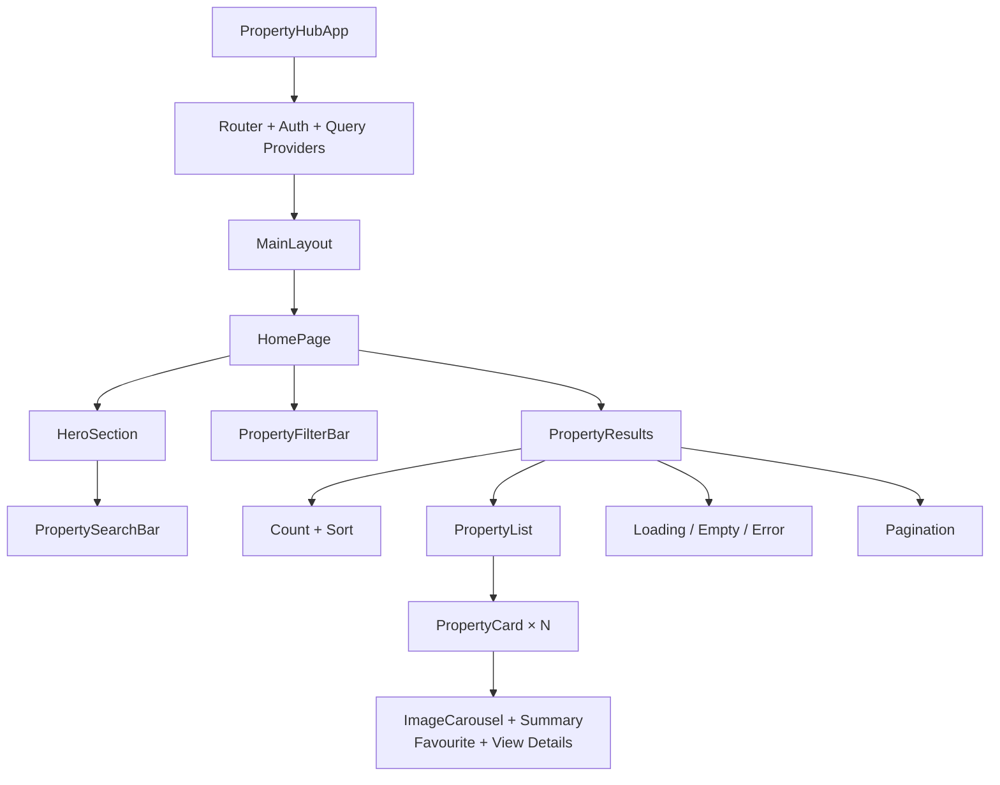
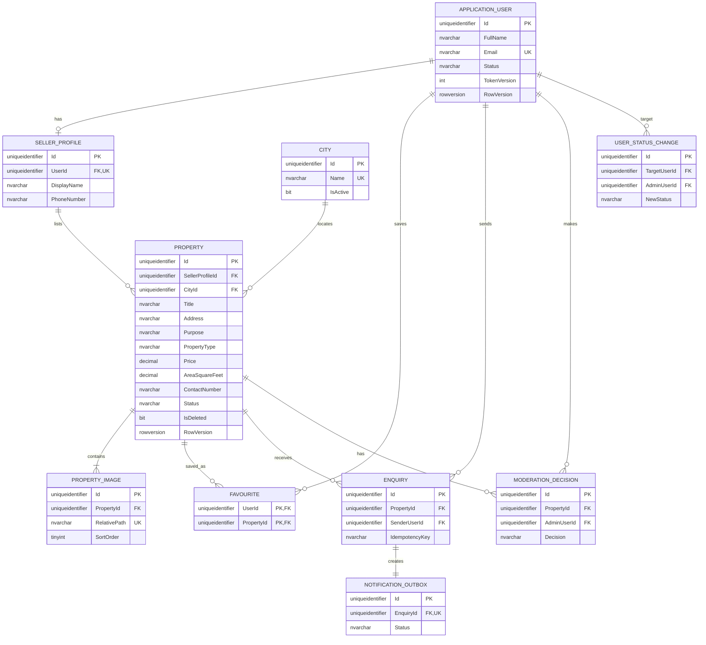
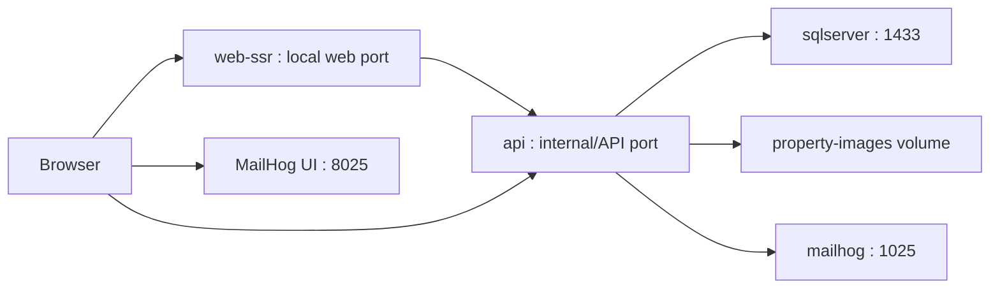

# PropertyHub — Business Requirements Document

**Document type:** Business Requirements and Software Specification  
**Project:** PropertyHub  
**Version:** 2.0  
**Status:** Development-ready technical baseline; external submission links pending  
**Deployment constraint:** Local-only capstone MVP  
**Frontend decision:** React 19 with Vite SSR and client hydration  
**Source of truth:** This Version 2.0 file supersedes the separate scope, architecture, component-tree, QA, use-case, Gherkin, and traceability drafts.

| Version | Date | Change |
|---|---|---|
| 1.0 | 2026-07-28 | Consolidated initial PropertyHub planning artifacts |
| 2.0 | 2026-07-28 | Resolved QA blockers; standardized Vite SSR; completed schema, APIs, security, tests, deployment, and traceability |

## Table of Contents

1. [Executive Summary](#1-executive-summary)
2. [Project Scope](#2-project-scope)
3. [Stakeholders and User Roles](#3-stakeholders-and-user-roles)
4. [Functional and Business Requirements](#4-functional-and-business-requirements)
5. [User Stories, INVEST Review, and Priorities](#5-user-stories-invest-review-and-priorities)
6. [Core Use Cases](#6-core-use-cases)
7. [Use-Case Diagram](#7-use-case-diagram)
8. [Gherkin Acceptance Criteria](#8-gherkin-acceptance-criteria)
9. [Technical Specification](#9-technical-specification)
10. [UAT Strategy](#10-uat-strategy)
11. [Implementation Plan](#11-implementation-plan)
12. [Project Board Plan](#12-project-board-plan)
13. [Risks and Dependencies](#13-risks-and-dependencies)
14. [Requirements Traceability Matrix](#14-requirements-traceability-matrix)
15. [QA Review and Resolutions](#15-qa-review-and-resolutions)
16. [AI-Assisted Development Record](#16-ai-assisted-development-record)
17. [Approval](#17-approval)
18. [Submission Links and External Gate Actions](#18-submission-links-and-external-gate-actions)

---

## 1. Executive Summary

PropertyHub is a locally hosted, multi-user real-estate marketplace inspired by a simplified Zameen.com. It enables visitors to discover approved properties, registered users to advertise and manage properties for sale or rent, and administrators to moderate listings and users.

The three-day MVP focuses on the complete business journey:

**Register or sign in → Submit property → Admin approval → Public discovery → Buyer enquiry → Owner follow-up**

The application will use a .NET 8 Web API, React 19 with Vite SSR and hydration, EF Core, SQL Server, Docker, JWT authentication, protected local image storage, and MailHog email notifications. No cloud service or live payment system is required.

### 1.1 Project Goal

Create a secure and usable local marketplace where property owners can publish validated listings and interested buyers or renters can discover and contact them, while administrators maintain platform quality through moderation and user management.

### 1.2 Success Measures

- A user can register, sign in, and submit a valid property with images.
- An admin can approve or reject a listing with an auditable decision.
- Only approved and available listings belonging to active users appear publicly.
- An authenticated user can view the owner’s phone number and submit an enquiry.
- The enquiry remains stored even if the local email notification fails.
- Public home, search, and property-detail routes return meaningful server-rendered HTML and hydrate without mismatch.
- All core components run locally through the documented development or Docker setup and expose health checks.

---

## 2. Project Scope

### 2.1 In Scope

- Registration and secure sign-in.
- One flexible registered account that can act as buyer, renter, seller, or owner.
- Property listings for **Sale** or **Rent**.
- Property types: **House, Apartment, Plot, Shop, and Office**.
- Listing creation with 1–5 validated images.
- Owner listing management: edit, soft-delete, and mark Sold/Rented.
- Admin approval and rejection with a mandatory reason.
- Correction and resubmission of rejected listings.
- Public browsing and property details.
- Search by city, purpose, type, price, area, bedrooms, and bathrooms.
- Favourites.
- Authenticated access to owner phone numbers.
- In-app property enquiries.
- Owner dashboard for received enquiries.
- Local MailHog email notification after an enquiry.
- Admin statistics, user management, listing moderation, and enquiry oversight.
- React with Vite SSR for public discovery routes and hydrated client interaction.
- Local execution using Docker, SQL Server, the .NET API, the Vite SSR Node server, and MailHog.

### 2.2 Out of Scope

- Real-time chat, video calls, or push notifications.
- Online payments, escrow, subscriptions, or paid featured listings.
- Map search, GPS coordinates, or live map services.
- Cloud hosting, cloud storage, or live third-party email.
- Agent/agency accounts, identity verification, property verification, and legal documents.
- Listing-expiry automation and enquiry workflow statuses.
- Auctions, mortgage calculators, AI recommendations, and native mobile apps.

### 2.3 Scope Decisions

| Topic | MVP decision |
|---|---|
| Images | 1–5 JPEG, PNG, or WebP files; maximum 5 MB each |
| Location | Database-backed seeded city dropdown and address; no map coordinates |
| Account model | One flexible Registered User account; Admin is privileged |
| Listing publication | Admin approval required |
| Rejection | Mandatory reason; owner may edit and resubmit |
| Enquiries | Stored read-only records; no workflow statuses; owners cannot enquire about their own property |
| Email | Transactional outbox record plus local MailHog delivery; enquiry storage does not depend on SMTP availability |
| Frontend rendering | Vite SSR for public home/search/detail pages; browser hydration; protected dashboards render after authentication |
| JWT lifecycle | 30-minute access token, held only in browser memory; no refresh token; logout clears memory; re-login after reload/expiry |
| Area comparison | Store normalized square feet using 1 Marla = 272.25 sq ft and 1 Kanal = 5,445 sq ft |
| Closed listings | Sold/Rented and soft-deleted listings cannot be reopened in the MVP |
| Retention | Database audit/history retained for the capstone; deleted-listing images become private and are removed by cleanup after 30 days |
| Availability date/time | Not included |
| Automatic expiry | Not included |

There are no blocking scope questions. New ideas will be treated as future enhancements unless required by an existing Must-Have story.

---

## 3. Stakeholders and User Roles

| Role | Description | Main goals |
|---|---|---|
| Visitor | An unauthenticated prospective buyer or renter | Browse and filter public properties; register or sign in |
| Registered User | A flexible account acting as buyer, renter, seller, or owner | Publish/manage listings, save favourites, view contact details, send and receive enquiries |
| Admin | A privileged platform administrator | Moderate listings, manage users, oversee enquiries, and view statistics |
| Mentor/Product Approver | Reviews the capstone planning gate | Confirm that scope, traceability, architecture, and plan are feasible |

> Buyer, renter, seller, and owner describe how a Registered User is acting. They are not separate stored roles.

---

## 4. Functional and Business Requirements

### 4.1 Authentication and Authorization

- `ApplicationUser : IdentityUser<Guid>` and `IdentityRole<Guid>` are canonical. Identity manages password hashing.
- Public registration never accepts a role and always assigns `RegisteredUser`; Admin accounts are seeded locally.
- Successful sign-in issues a signed 30-minute JWT containing user ID, role, and token-version/security-stamp claim.
- The browser stores the JWT only in React memory, never in `localStorage`, `sessionStorage`, a URL, or an SSR HTML payload. Reloading or closing the page requires sign-in again.
- Client logout clears the in-memory token. The MVP has no refresh token.
- Public browsing will not require authentication.
- Listing, favourite, contact, enquiry, and owner-dashboard actions require an active authenticated account.
- Admin endpoints require the Admin role.
- Missing, invalid, or expired JWTs return `401 Unauthorized`.
- Suspended accounts and authenticated non-admins using admin endpoints return `403 Forbidden`.
- Every protected request applies an `ActiveUser` policy that checks the database account status and token version/security stamp, so suspension invalidates already-issued tokens immediately.
- Identity uses unique normalized email, a minimum eight-character password containing uppercase, lowercase, digit, and non-alphanumeric characters, plus a five-failure/15-minute lockout.
- Registration and login are rate-limited per IP/account.

### 4.2 Property Listing Rules

- Required fields: title, description, purpose, type, city, address, price, area, contact number, and images.
- The trimmed title must contain 5–100 characters.
- The trimmed description must contain 20–2,000 characters.
- Price and area must be greater than zero.
- House and Apartment require positive bedroom and bathroom values.
- Shop and Office allow optional non-negative bedroom and bathroom values.
- Plot does not accept bedroom or bathroom values.
- A listing must have 1–5 JPEG, PNG, or WebP images, no larger than 5 MB each.
- The API validates file extension, declared MIME type, and file signature; API validation is authoritative.
- A valid new listing is stored with `Pending Approval` status and remains hidden publicly.
- Material fields are title, description, purpose, type, city, address, price, area/unit, bedrooms, bathrooms, contact number, and any image add/remove/reorder.
- A material edit to an Approved listing returns it to Pending Approval. Editing a Rejected listing keeps it Rejected until explicit resubmission.
- Marking a listing Sold/Rented does not require reapproval but removes it from default public results.
- Sold/Rented and soft-deleted listings are terminal and cannot be reopened or edited in the MVP.
- Owner deletion is a soft delete.

### 4.3 Duplicate and Atomicity Rules

A listing is a duplicate when the same owner already has a non-deleted listing with the same:

- trimmed, case-insensitive title;
- trimmed, case-insensitive address;
- purpose; and
- property type.

Another owner may use the same details, and a soft-deleted match is ignored. Failed submissions create neither a listing nor orphaned image records/files. Repeated processing of the same `Idempotency-Key` for the same user returns the original result and creates at most one listing.

### 4.4 Moderation Rules

- Admins review pending listing details and images.
- Approval requires valid mandatory data, safe images, allowed values, and no prohibited or clearly misleading content.
- Rejection requires a non-blank reason visible to the owner.
- Valid transitions are:
  - `Pending Approval → Approved`
  - `Pending Approval → Rejected`
  - `Rejected → Pending Approval` only through explicit resubmission after correction
  - `Approved → Pending Approval` after a material edit
  - `Approved → Sold/Rented`
  - Any owner deletion → soft-deleted
- Moderation uses an objective checklist: required fields valid; supported category and city; 1–5 safe images; no contact data hidden in descriptions; and no discriminatory, illegal, abusive, duplicate, prohibited, or clearly misleading content.
- Rejection codes are `IncompleteDetails`, `InvalidImage`, `DuplicateListing`, `MisleadingContent`, `ProhibitedContent`, and `Other`; `Other` requires explanatory text.
- Updates return an `ETag`; clients send `If-Match`. A stale property or user update returns `412 Precondition Failed`.

### 4.5 Public Discovery and Contact

- “Publicly available” means `Status = Approved`, `IsDeleted = false`, and seller account `Status = Active`.
- Visitors can view listing details and images but not owner phone numbers.
- Logged-in active users may view the owner’s phone number and submit an enquiry of 1–1,000 trimmed characters.
- The listing-specific `Property.ContactNumber` is the exposed source of truth. `SellerProfile.PhoneNumber` is only the default for new listings; later profile changes do not rewrite existing listing contacts.
- Owners cannot favourite or enquire about their own property; the API returns `409 Conflict`.
- A successful enquiry is stored once and appears in the owner’s dashboard.
- The enquiry transaction creates one Notification Outbox record. A local background worker delivers it to MailHog with retry and never creates another enquiry.
- Replaying the same sender/idempotency key returns the original enquiry and notification state; it does not force immediate email retry.

### 4.6 Administration

- Dashboard metrics use current UTC and include registered users excluding seeded Admins, active/suspended totals, non-deleted properties by status, pending moderation count, and all historical enquiries.
- Admins can view/search users, suspend active accounts, and reactivate suspended accounts.
- Suspension immediately blocks sign-in and protected actions, hides the user’s public listings, and preserves historical enquiry data for admin review.
- Admins cannot suspend themselves, another Admin, or remove the last Admin through the MVP API.
- Every suspension/reactivation records actor, target, previous/new state, reason, UTC timestamp, and correlation ID in an immutable audit record.
- Admins can view the listing moderation queue and enquiry overview.

---

## 5. User Stories, INVEST Review, and Priorities

**INVEST:** Independent, Negotiable, Valuable, Estimable, Small, Testable.

| ID | User story | Business value | Priority | INVEST met | Risk or split |
|---|---|---|---|---|---|
| US-01 | As a visitor, I want to browse approved and available property listings so that I can explore properties without creating an account. | Attracts buyers/renters without exposing restricted inventory. | Must | I, N, V, E, S, T | None |
| US-02 | As a visitor, I want to filter approved properties by city, purpose, type, price, area, bedrooms, and bathrooms so that I can quickly find relevant properties. | Reduces discovery time. | Must: basic; Should: advanced | N, V, E, T | I/S risk; split into basic, price/area, and room filters |
| US-03 | As a visitor, I want to create an account so that I can publish listings, save favourites, view contact details, and send enquiries. | Converts visitors into participants. | Must | I, N, V, E, S, T | None |
| US-04 | As a registered user, I want to sign in securely so that I can access protected features associated with my account. | Protects data and enables personalized actions. | Must | I, N, V, E, S, T | None |
| US-05 | As a registered user, I want to submit valid property details with one to five safe images so that I can request publication of a property for sale or rent. | Creates marketplace inventory. | Must | N, V, E, T | I/S risk; split field validation, image handling, and atomic submission |
| US-06 | As a registered user, I want to maintain my own listings so that property information and availability remain accurate. | Prevents stale or misleading listings. | Must | N, V, E, T | Split edit, soft-delete, and Sold/Rented actions |
| US-07 | As a registered user, I want to add or remove an available property from my favourites so that I can revisit listings I am considering. | Improves convenience and engagement. | Nice | I, N, V, E, S, T | None |
| US-08 | As a registered user, I want to view an owner’s phone number and submit an enquiry about an approved, available property so that I can discuss it with the owner. | Converts interest into leads. | Must | N, V, E, T | Split phone reveal, enquiry storage, and notification |
| US-09 | As a registered user, I want to view enquiries received for my own listings so that I can follow up with interested users. | Enables owner follow-up. | Must | I, N, V, E, S, T | None |
| US-10 | As an admin, I want to approve a compliant pending listing or reject it with a reason so that only valid and safe listings become publicly visible. | Protects marketplace quality. | Must | I, N, V, E, S, T | None |
| US-11 | As a registered user, I want to view the rejection reason, correct my rejected listing, and resubmit it so that the admin can reconsider it. | Supports a fair moderation cycle. | Should | N, V, E, T | I/S risk; split feedback view and resubmission |
| US-12 | As an admin, I want to view, search, suspend, and reactivate registered users so that I can protect the platform from misuse. | Provides administrative access control. | Must | N, V, E, T | Split search, suspend, and reactivate |
| US-13 | As an admin, I want to view counts of users, enquiries, and listings by status so that I can understand activity and prioritize work. | Meets the admin data-overview requirement. | Must | I, N, V, E, S, T | Keep to summary cards |

### 5.1 MoSCoW Summary

- **Must Have:** US-01, US-02A, US-03, US-04, US-05, US-06A/B/C, US-08, US-09, US-10, US-12, US-13.
- **Should Have:** US-02B/C and US-11.
- **Nice to Have:** US-07.

Priority follows the core dependency chain: authentication enables submission; submission enables moderation; approval enables discovery; discovery enables enquiries.

### 5.2 Why These Are the Top Five for Gherkin

US-01, US-04, US-05, US-10, and US-08 are the top five because together they prove the complete revenue-enabling journey and contain the highest security or state-transition risk: public visibility, authentication, atomic upload, moderation, and buyer-to-owner contact. US-03 registration is essential but uses standard Identity validation; US-06 listing management and the other Must-Have stories receive concise API acceptance rules in Section 8.6 and must pass UAT before delivery.

---

## 6. Core Use Cases

### UC-01 — Browse Approved Properties

| Field | Details |
|---|---|
| Related story | US-01 |
| Primary actor | Visitor |
| Preconditions | PropertyHub is running; authentication is not required. |
| Main flow | 1. Visitor opens Properties.<br>2. API retrieves Approved, available, non-deleted listings owned by active users.<br>3. System displays public summary cards without private contact data.<br>4. Visitor selects a listing.<br>5. System displays its public details and images. |
| Alternate flow A | No eligible listing exists; show an empty state without restricted data. |
| Alternate flow B | Selected listing becomes unavailable; return `404 Not Found` and disclose no hidden data. |
| Alternate flow C | Retrieval fails; display a retryable non-technical error. |
| Postcondition | Public data is displayed, or no restricted listing/contact data is disclosed. |

### UC-02 — Sign In Securely

| Field | Details |
|---|---|
| Related story | US-04 |
| Primary actor | Registered User |
| Preconditions | A registered account exists and the API is available. |
| Main flow | 1. User enters email and password.<br>2. Identity verifies normalized email, password hash, and account status.<br>3. API issues a signed, expiring JWT with user ID and role.<br>4. Client creates the authenticated session.<br>5. User is redirected to the intended page/dashboard. |
| Alternate flow A | Invalid credentials return `401`; no token is issued and the response does not reveal account existence. |
| Alternate flow B | Correct credentials for a suspended account return `403`; no token is issued. |
| Alternate flow C | Blank/malformed input fails validation. |
| Postcondition | A valid session exists for an active user, or no token/session is created. |

### UC-03 — Submit a Property Listing

| Field | Details |
|---|---|
| Related story | US-05 |
| Primary actor | Registered User acting as Owner |
| Preconditions | The account is active/authenticated and has valid details plus 1–5 valid images. |
| Main flow | 1. User opens Add Property.<br>2. User enters details and selects images.<br>3. Client validates the form.<br>4. API revalidates authorization, fields, property-specific rules, duplicate signature, and file safety.<br>5. System stores the listing and images atomically.<br>6. Listing receives an ID and Pending Approval status.<br>7. It appears in My Listings but not publicly. |
| Alternate flow A | Invalid fields return `400`; no listing or image is stored. |
| Alternate flow B | Unsafe image selection rejects the entire request and stores no file. |
| Alternate flow C | Duplicate data with a new idempotency key returns `409`; replaying the same key returns the original result. No duplicate is created. |
| Alternate flow D | Authentication, suspension, database, or storage failure leaves no partial data/orphaned file. |
| Postcondition | Exactly one hidden Pending Approval listing exists, or no new data exists. |

### UC-04 — Moderate a Property Listing

| Field | Details |
|---|---|
| Related story | US-10 |
| Primary actor | Admin |
| Preconditions | Active Admin account; listing exists with Pending Approval status. |
| Main flow | 1. Admin opens Pending Approvals.<br>2. Admin reviews owner, details, images, and safety/quality rules.<br>3. Admin selects Approve.<br>4. API verifies role and current version.<br>5. Status becomes Approved; decision, admin, and timestamp are recorded.<br>6. Listing becomes public and leaves the pending queue. |
| Alternate flow A | Admin rejects with a reason; listing remains hidden and the owner can see the reason. |
| Alternate flow B | Blank rejection reason returns `400`; state is unchanged. |
| Alternate flow C | Non-admin or suspended admin receives `403`; state is unchanged. |
| Alternate flow D | A stale `If-Match` value returns `412 Precondition Failed`; only the first valid decision is stored. |
| Postcondition | Listing is Approved and public, Rejected and hidden with a reason, or unchanged after failure. |

### UC-05 — Contact a Property Owner

| Field | Details |
|---|---|
| Related story | US-08 |
| Primary actor | Registered User acting as Buyer/Renter |
| Preconditions | Actor and owner are active; actor is authenticated; listing is Approved and available. |
| Main flow | 1. User opens listing details and selects Contact Owner.<br>2. System reveals the owner’s phone number.<br>3. User may call or submit a 1–1,000-character enquiry.<br>4. API rechecks authentication and availability.<br>5. Enquiry is stored once.<br>6. MailHog notification is requested.<br>7. Buyer sees confirmation and owner sees the enquiry. |
| Alternate flow A | Unauthenticated visitor sees no phone number; direct API request returns `401`. |
| Alternate flow B | Blank/oversized message returns `400`; no enquiry/email is created. |
| Alternate flow C | A missing/hidden property returns `404`; a known but Sold/Rented property or self-enquiry returns `409`; no enquiry is stored. |
| Alternate flow D | MailHog failure is logged while the enquiry remains stored once. |
| Postcondition | Exactly one enquiry exists and is visible to the owner, or no enquiry exists after validation/authorization failure. |

### UC-06 — Filter Properties

| Field | Details |
|---|---|
| Related story | US-02 |
| Primary actor | Visitor |
| Preconditions | Public catalogue is available. |
| Main flow | 1. Visitor sets keyword/basic/advanced filters.<br>2. Values are placed in the URL.<br>3. API validates and applies all filters using normalized area.<br>4. SSR or hydrated React displays the requested page and sort. |
| Alternate flows | Invalid ranges/enums return `400`; no match shows an empty state; page beyond results returns an empty items array. |
| Postcondition | Results and URL represent the same validated query. |

### UC-07 — Register

| Field | Details |
|---|---|
| Related story | US-03 |
| Primary actor | Visitor |
| Preconditions | Visitor is unauthenticated. |
| Main flow | 1. Visitor enters full name, email, password.<br>2. API validates and normalizes.<br>3. Identity creates Active user.<br>4. System assigns RegisteredUser only.<br>5. User may sign in. |
| Alternate flows | Duplicate/invalid data returns `400`; rate limit returns `429`; client-supplied role is rejected. |
| Postcondition | One non-privileged account exists or no account is created. |

### UC-08 — Manage Own Listings

| Field | Details |
|---|---|
| Related story | US-06 |
| Primary actor | Registered User acting as Owner |
| Preconditions | User owns the listing and holds its current ETag. |
| Main flow | 1. Owner opens My Listings.<br>2. Owner edits, changes availability, or soft-deletes.<br>3. API verifies ownership/state/concurrency.<br>4. API applies the transition and returns a new ETag. |
| Alternate flows | Another user receives `404`; stale ETag returns `412`; terminal listing returns `409`; invalid image count returns `409`. |
| Postcondition | An authorized valid mutation is stored or state remains unchanged. |

### UC-09 — Manage Favourites

| Field | Details |
|---|---|
| Related story | US-07 |
| Primary actor | Registered User |
| Preconditions | Active authenticated user; publicly available non-owned property. |
| Main flow | User saves or removes the property; API performs an idempotent composite-key operation; UI updates. |
| Alternate flows | Visitor is redirected to login/direct API gets `401`; own/unavailable property returns `409`/`404`. |
| Postcondition | Exactly one favourite exists after save, or none after remove. |

### UC-10 — Review Received Enquiries

| Field | Details |
|---|---|
| Related story | US-09 |
| Primary actor | Registered User acting as Owner |
| Preconditions | User owns at least one listing or receives an empty result. |
| Main flow | Owner opens received enquiries; API filters by owned property IDs; returns newest-first paginated safe sender data. |
| Alternate flows | No enquiries shows empty state; another user’s property filter returns `404`; expired login returns `401`. |
| Postcondition | Only enquiries associated with the current owner are disclosed. |

### UC-11 — Correct and Resubmit

| Field | Details |
|---|---|
| Related story | US-11 |
| Primary actor | Registered User acting as Owner |
| Preconditions | Owned listing is Rejected and latest reason is visible. |
| Main flow | Owner edits while status stays Rejected; resolves validation/rejection issue; explicitly resubmits with ETag; status becomes PendingApproval. |
| Alternate flows | Uncorrected invalid data returns `400`; stale ETag returns `412`; non-owner gets `404`; non-Rejected state returns `409`. |
| Postcondition | Corrected listing re-enters moderation and history is preserved, or it remains Rejected. |

### UC-12 — Manage Users

| Field | Details |
|---|---|
| Related story | US-12 |
| Primary actor | Admin |
| Preconditions | Active Admin; target is RegisteredUser. |
| Main flow | Admin searches/selects target; supplies new status, reason, ETag; API updates status/token version, hides/restores eligible public visibility, and writes immutable audit. |
| Alternate flows | Self/Admin target returns `409`; stale ETag returns `412`; missing reason returns `400`; non-admin returns `403`. |
| Postcondition | Target status and token validity change atomically with an audit record, or nothing changes. |

### UC-13 — View Admin Dashboard

| Field | Details |
|---|---|
| Related story | US-13 |
| Primary actor | Admin |
| Preconditions | Active Admin is authenticated and database is ready. |
| Main flow | Admin opens dashboard; API calculates metrics using documented inclusion rules and one `asOfUtc`; cards display totals. |
| Alternate flows | Non-admin gets `403`; database failure returns sanitized `500`; zero-data state displays zeros. |
| Postcondition | Admin sees internally consistent current metrics without sensitive detail. |

---

## 7. Use-Case Diagram



Buyer, renter, seller, and owner are activities of the `Registered User` actor, not separate authorization roles.

---

## 8. Gherkin Acceptance Criteria

### 8.1 US-01 — Browse Approved Properties

```gherkin
Feature: Browse approved properties
  As a visitor
  I want to browse approved and available property listings
  So that I can explore properties without creating an account

  Scenario: Browse publicly available properties
    Given approved, pending, sold, and suspended-owner listings exist
    When the visitor opens the property catalogue
    Then only approved, available, non-deleted listings owned by active users should appear
    And owner phone numbers should remain hidden

  Scenario: No public property is available
    Given no listing satisfies the public visibility rules
    When the visitor opens the property catalogue
    Then an empty-state message should be displayed
    And no restricted listing data should be disclosed

  Scenario: A selected property becomes unavailable
    Given the visitor previously saw an approved property
    And it is now unavailable or hidden
    When the visitor requests its public details
    Then the API should return "404 Not Found"
    And no owner contact details should be disclosed
```

### 8.2 US-04 — Sign In Securely

```gherkin
Feature: Sign in securely
  As a registered user
  I want to sign in securely
  So that I can access protected features

  Scenario: Sign in with valid credentials
    Given an active registered user exists
    When the user submits the correct email and password
    Then a signed, time-limited JWT containing user ID and role should be issued

  Scenario: Sign in with invalid credentials
    Given a registered user is on the sign-in page
    When incorrect credentials are submitted
    Then the API should return "401 Unauthorized"
    And no session should be created
    And the response should not reveal whether the account exists

  Scenario: A suspended user attempts to sign in
    Given the account is suspended
    When correct credentials are submitted
    Then the API should return "403 Forbidden"
    And no JWT should be issued

  Scenario Outline: Required input is invalid
    When the user submits "<invalid input>"
    Then validation should reject the request
    And no JWT should be issued

    Examples:
      | invalid input             |
      | a blank email address     |
      | a malformed email address |
      | a blank password          |
```

### 8.3 US-05 — Submit a Property Listing

```gherkin
Feature: Submit a property listing
  As a registered user
  I want to submit valid property details with safe images
  So that I can request publication of a property

  Scenario: Successfully submit a valid property
    Given an active registered user is authenticated
    And all mandatory property details are valid
    And 1 to 5 valid JPEG, PNG, or WebP images no larger than 5 MB are selected
    When the user submits the property
    Then exactly one listing should be created with "Pending Approval" status
    And it should appear in "My Listings"
    And it should not appear publicly

  Scenario Outline: Reject a missing or invalid required field
    Given an active registered user is authenticated
    And all other fields and one image are valid
    But "<field>" contains "<invalid value>"
    When the user submits the property
    Then the API should return "400 Bad Request"
    And no listing or image should be stored

    Examples:
      | field          | invalid value            |
      | Title          | blank                    |
      | Title          | fewer than 5 characters |
      | Title          | more than 100 characters |
      | Purpose        | Auction                  |
      | Property type  | Hotel                    |
      | Price          | 0                        |
      | Area size      | -1                       |
      | City           | blank                    |
      | Address        | blank                    |
      | Description    | fewer than 20 characters |
      | Description    | more than 2000 characters |
      | Contact number | blank                    |

  Scenario Outline: Reject an invalid image selection
    Given all property details are valid
    But the selection contains "<image problem>"
    When the user submits the property
    Then the API should return "400 Bad Request"
    And no listing, image record, or file should be stored

    Examples:
      | image problem                                  |
      | no image                                       |
      | 6 images                                       |
      | a file larger than 5 MB                        |
      | an unsupported or corrupt file                 |
      | a file whose signature does not match its type |

  Scenario: Reject a duplicate property
    Given the same user owns a non-deleted listing
    And title, address, purpose, and type match after normalization
    When the user submits the property
    Then the API should return "409 Conflict"
    And no duplicate listing should be stored

  Scenario Outline: An unauthorized account attempts submission
    Given the request uses "<account state>"
    When the submission is sent to the API
    Then the API should return "<response>"
    And no listing or image should be stored

    Examples:
      | account state       | response         |
      | no JWT              | 401 Unauthorized |
      | an invalid JWT      | 401 Unauthorized |
      | an expired JWT      | 401 Unauthorized |
      | a suspended account | 403 Forbidden    |

  Scenario: Submission storage fails
    Given all details and images are valid
    And database or image storage fails
    When the user submits the property
    Then the operation should be rolled back
    And no orphaned file should remain
```

> There is no availability date/time field in the MVP; therefore, a “date/time in the past” scenario is intentionally not applicable.

### 8.4 US-10 — Moderate Property Listings

```gherkin
Feature: Moderate property listings
  As an admin
  I want to approve compliant listings or reject them with a reason
  So that only safe and valid listings become public

  Scenario: Approve a compliant property
    Given an active admin is authenticated
    And a compliant listing is "Pending Approval"
    When the admin approves it
    Then its status should become "Approved"
    And the admin identifier and timestamp should be recorded
    And it should become publicly visible

  Scenario: Reject a property with a reason
    Given an active admin is authenticated
    And a listing is "Pending Approval"
    When the admin rejects it with a non-blank reason
    Then its status should become "Rejected"
    And it should remain hidden
    And the owner should see the reason

  Scenario: Reject without a reason
    When an admin rejects a pending listing with a blank reason
    Then the API should return "400 Bad Request"
    And the listing should remain "Pending Approval"

  Scenario Outline: Unauthorized moderation
    Given a listing is "Pending Approval"
    When "<actor>" attempts to moderate it
    Then the API should return "403 Forbidden"
    And the listing should remain unchanged

    Examples:
      | actor             |
      | a non-admin user  |
      | a suspended admin |

  Scenario: Concurrent moderation
    Given one admin has already moderated a listing
    When another admin submits a decision with a stale "If-Match" value
    Then the API should return "412 Precondition Failed"
    And only the first valid decision should be recorded
```

### 8.5 US-08 — Contact a Property Owner

```gherkin
Feature: Contact a property owner
  As a registered user
  I want to view an owner's phone number and submit an enquiry
  So that I can discuss an available property

  Scenario: View the owner's phone number
    Given an approved and available property belongs to an active user
    And an active registered user is authenticated
    When the user selects "Contact Owner"
    Then the owner's phone number should be displayed

  Scenario: Submit a valid enquiry
    Given an active registered user is authenticated
    And the property is approved and available
    And the message contains 1 to 1000 trimmed characters
    When the user submits the enquiry
    Then exactly one enquiry should be stored
    And it should appear for the owner
    And a MailHog notification should be requested

  Scenario: An unauthenticated visitor attempts contact
    Given the visitor is not authenticated
    When the visitor opens the property
    Then the phone number should remain hidden
    And the visitor should be prompted to sign in
    When an enquiry is sent directly to the API
    Then the API should return "401 Unauthorized"

  Scenario Outline: Reject an invalid message
    Given an active user is authenticated
    And the property is approved and available
    When the user submits "<invalid message>"
    Then the API should return "400 Bad Request"
    And no enquiry or email should be created

    Examples:
      | invalid message           |
      | blank                     |
      | whitespace only           |
      | more than 1000 characters |

  Scenario: MailHog is unavailable
    Given a valid enquiry is submitted
    And MailHog is unavailable
    Then exactly one enquiry should remain stored
    And the email failure should be logged
    And retrying should not duplicate the enquiry
```

### 8.6 Supporting Acceptance Criteria for Remaining Stories

These scenarios remove implementation ambiguity for every remaining Must-Have story. Should/Nice scenarios are included so they are ready if pulled into a sprint.

```gherkin
Feature: Filter public properties
  Scenario: Apply combined valid filters
    Given publicly available properties exist in multiple cities and categories
    When a visitor filters by city, purpose, type, price, normalized area, minimum bedrooms, and minimum bathrooms
    Then every returned property should satisfy every supplied filter
    And results should be ordered by the requested whitelisted sort

  Scenario: Reject an invalid filter
    When a visitor supplies an unsupported enum, negative range, min greater than max, page below 1, or page size above 50
    Then the API should return "400 Bad Request" with RFC 7807 details

Feature: Register an account
  Scenario: Register with valid data
    Given the normalized email is unused
    When a visitor submits a valid full name, email, and compliant password
    Then an active "RegisteredUser" account should be created
    And no client-supplied role should be accepted

  Scenario: Registration is invalid or rate limited
    When registration contains invalid fields, a duplicate normalized email, or exceeds the rate limit
    Then the API should return "400 Bad Request" or "429 Too Many Requests"
    And no privileged role or duplicate account should be created

Feature: Manage my listings
  Scenario: Owner edits a public field on an approved listing
    Given an active owner has the current ETag for an approved listing
    When the owner edits a material field with "If-Match"
    Then the update should succeed
    And the listing should become "PendingApproval"

  Scenario: Owner edits and resubmits a rejected listing
    Given the owner has corrected a rejected listing
    When the owner explicitly resubmits it with the current ETag
    Then its status should become "PendingApproval"
    And the previous rejection should remain in moderation history

  Scenario Outline: Reject forbidden listing mutation
    When "<actor>" attempts "<operation>"
    Then the API should return "<status>"
    Examples:
      | actor                 | operation                         | status                  |
      | another user          | edit an owner's listing           | 404 Not Found           |
      | owner with stale ETag | edit a listing                    | 412 Precondition Failed |
      | owner                 | reopen a Sold or Rented listing   | 409 Conflict            |
      | owner                 | remove the only remaining image   | 409 Conflict            |

Feature: Review received enquiries
  Scenario: Owner views enquiries for owned listings
    Given enquiries exist for the user's properties
    When the owner opens received enquiries
    Then only enquiries for properties owned by that user should be returned
    And results should be newest first and paginated

  Scenario: Another user requests an enquiry by identifier
    When a user who is neither sender nor property owner requests the enquiry
    Then the API should return "404 Not Found"

Feature: Manage registered users
  Scenario: Admin suspends an active registered user
    Given an active admin and an active registered-user target
    When the admin supplies a reason and current ETag
    Then the user should become "Suspended"
    And existing JWTs should fail the next protected request
    And public listings should disappear
    And an immutable status-change audit should be stored

  Scenario Outline: Reject unsafe admin status changes
    When an admin attempts to suspend "<target>"
    Then the API should return "<status>"
    Examples:
      | target               | status                  |
      | themselves           | 409 Conflict            |
      | another Admin        | 409 Conflict            |
      | a user with stale ETag | 412 Precondition Failed |

Feature: View admin statistics
  Scenario: Dashboard counts use defined rules
    Given current and historical platform data exists
    When an active admin opens the dashboard
    Then user counts should exclude seeded Admin accounts
    And property counts should exclude soft-deleted properties
    And enquiry totals should include historical enquiries

Feature: Save favourites
  Scenario: Save and remove a visible property
    Given an active user is not the property owner
    When the user saves and then removes an available property
    Then both operations should be idempotent

  Scenario: Owner favourites own property
    When an owner attempts to favourite their own property
    Then the API should return "409 Conflict"

Feature: Resubmit a rejected property
  Scenario: Explicit resubmission after correction
    Given a rejected property has a visible reason and valid corrected data
    When its owner posts a resubmission with the current ETag
    Then it should become "PendingApproval"

  Scenario: Resubmission without correction
    Given the listing still violates its latest rejection reason
    When the owner attempts resubmission
    Then the API should return "400 Bad Request"
    And it should remain "Rejected"
```

---

## 9. Technical Specification

### 9.1 Architecture Overview



PropertyHub uses four local Docker services: `web-ssr`, `api`, `sqlserver`, and `mailhog`; the MailHog service also exposes its web inbox. The API is the only component allowed to access SQL Server or the image volume.

### 9.2 Vite SSR and React Rendering Contract

- Vite has `entry-server.jsx` for server rendering, `entry-client.jsx` for hydration, and a Node SSR server for production-like local execution.
- `/`, `/properties`, and `/properties/:id` are server-rendered from public API data for meaningful initial HTML.
- The server serializes only public DTOs, escapes serialized JSON before embedding it, and never embeds JWTs, contact numbers, admin data, or private listing states.
- `hydrateRoot` reuses the exact route and initial data. Hydration mismatch is a test failure.
- Filters, sort, page, and keyword are stored in the URL query string so SSR, refresh, browser back/forward, and shared URLs produce the same results.
- `/login`, `/register`, `/my/*`, and `/admin/*` use the shared React application. Protected data loads only after hydration and authentication.
- The Node SSR server does not hold user sessions. The browser keeps the short-lived JWT in memory and sends it as a bearer token directly to the API.
- On `401`, React clears authentication state and redirects to `/login?returnUrl=<encoded-local-path>`. On `403`, it displays an accessible authorization message without revealing protected data.

Implementation references: [Vite SSR Guide](https://vite.dev/guide/ssr), [Vite SSR build option](https://vite.dev/config/build-options#build-ssr), and [React `hydrateRoot`](https://react.dev/reference/react-dom/client/hydrateRoot).

### 9.3 Home Page React Component Tree



`HomePage` derives query state from the URL and calls `GET /api/properties`. `PropertyCard` receives only public DTO fields. A favourite click by a visitor redirects to login with a safe local return URL.

### 9.4 Technology Stack

| Layer | Technology | Purpose |
|---|---|---|
| Frontend | React 19, React Router, Vite SSR | Server-rendered public routes, hydration, protected dashboards |
| SSR runtime | Node.js LTS | Local HTML rendering and static asset delivery |
| Backend | ASP.NET Core .NET 8 Web API | Business rules, validation, authorization, and APIs |
| Authentication | ASP.NET Core Identity + short-lived JWT | Accounts, password hashing, roles, bearer authentication |
| Data access | Entity Framework Core | Persistence and migrations |
| Database | Local SQL Server | Users, listings, images, favourites, enquiries, and moderation records |
| File storage | Docker volume outside `wwwroot` | Private validated property images |
| Email integration | MailHog + outbox worker | Local SMTP capture and reliable notification demonstration |
| Containers | Docker Compose | Repeatable SSR, API, database, and MailHog environment |
| Testing | xUnit, WebApplicationFactory, Vitest, React Testing Library, Playwright/manual UAT | Unit, integration, SSR/hydration, authorization, and workflow verification |

### 9.5 Suggested Solution Structure

```text
PropertyHub/
├── src/
│   ├── PropertyHub.Api/              # Controllers, Program.cs, middleware
│   ├── PropertyHub.Application/      # DTOs, validators, use cases, interfaces
│   ├── PropertyHub.Domain/           # Entities, enums, business rules
│   ├── PropertyHub.Infrastructure/   # EF Core, Identity, files, SMTP/outbox
│   └── propertyhub-web/              # React, entry-client, entry-server, SSR server
├── tests/
│   ├── PropertyHub.UnitTests/
│   ├── PropertyHub.IntegrationTests/
│   └── propertyhub-web-tests/
├── docker-compose.yml
├── .env.example
└── Businessrequirementdoc.md
```

`Program.cs` owns service registration, authentication/authorization, rate limits, CORS, exception handling, security headers, health checks, static/API routing, and application startup. Controllers call application services; only Infrastructure uses EF Core or external I/O.

### 9.6 Canonical Data Model

All IDs are server-generated `Guid`; timestamps are UTC; string input is trimmed; public DTOs never expose Identity security fields.

#### ApplicationUser

Extends `IdentityUser<Guid>`; Identity role membership is stored in standard Identity tables rather than a duplicate `Role` column.

| Attribute | Type | Constraints |
|---|---|---|
| `Id` | `uniqueidentifier` | PK |
| `FullName` | `nvarchar(100)` | Required; 2–100 |
| `Email` / `NormalizedEmail` | Identity fields | Required; normalized email unique |
| `PasswordHash` | Identity field | Required; never returned/logged |
| `Status` | `nvarchar(20)` | `Active` or `Suspended`; default Active |
| `TokenVersion` | `int` | Required; increment on suspend/reactivate |
| `CreatedAtUtc`, `UpdatedAtUtc` | `datetime2` | Required |
| `RowVersion` | `rowversion` | Concurrency token/ETag source |

#### SellerProfile

One optional profile per user. On first property submission, the API creates it with `DisplayName = ApplicationUser.FullName` and `PhoneNumber = submitted ContactNumber`. Its phone is only a default for future listings.

| Attribute | Type | Constraints |
|---|---|---|
| `Id` | `uniqueidentifier` | PK |
| `UserId` | `uniqueidentifier` | Required FK; unique |
| `DisplayName` | `nvarchar(100)` | Required; 2–100 |
| `PhoneNumber` | `nvarchar(20)` | Required; validated |
| `CreatedAtUtc`, `UpdatedAtUtc` | `datetime2` | Required |

#### City

| Attribute | Type | Constraints |
|---|---|---|
| `Id` | `uniqueidentifier` | PK |
| `Name` | `nvarchar(100)` | Required; normalized unique |
| `IsActive` | `bit` | Required; only active cities accepted for new/edit submissions |

Seed Lahore, Karachi, Islamabad, Rawalpindi, Faisalabad, Multan, Peshawar, and Quetta. Seed changes require a migration.

#### Property

| Attribute | Type | Constraints |
|---|---|---|
| `Id` | `uniqueidentifier` | PK |
| `SellerProfileId` | `uniqueidentifier` | Required FK; indexed |
| `CityId` | `uniqueidentifier` | Required FK; indexed |
| `Title` | `nvarchar(100)` | Required; 5–100 |
| `NormalizedTitle` | `nvarchar(100)` | Required; server-generated for duplicate check |
| `Description` | `nvarchar(2000)` | Required; 20–2,000 |
| `Purpose` | `nvarchar(10)` | `Sale` or `Rent` |
| `PropertyType` | `nvarchar(20)` | `House`, `Apartment`, `Plot`, `Shop`, `Office` |
| `Address` / `NormalizedAddress` | `nvarchar(250)` | Required; 5–250 / server normalized |
| `Price` | `decimal(18,2)` | Required; > 0 |
| `Area` | `decimal(12,2)` | Required; > 0 |
| `AreaUnit` | `nvarchar(20)` | `SquareFeet`, `Marla`, `Kanal` |
| `AreaSquareFeet` | `decimal(14,2)` | Required; server-calculated for filters |
| `Bedrooms`, `Bathrooms` | `int?` | House/Apartment positive; Shop/Office optional ≥0; Plot null |
| `ContactNumber` | `nvarchar(20)` | Required listing snapshot; exposed only to active authenticated non-owner users |
| `Status` | `nvarchar(30)` | `PendingApproval`, `Approved`, `Rejected`, `Sold`, `Rented` |
| `SubmissionKey` | `nvarchar(100)` | Unique with seller user ID |
| `IsDeleted` | `bit` | Default false |
| `CreatedAtUtc`, `UpdatedAtUtc`, `DeletedAtUtc?` | `datetime2` | Audit timestamps |
| `RowVersion` | `rowversion` | Concurrency/ETag |

Unique non-deleted duplicate signature: seller + normalized title + normalized address + purpose + type. SQL Server filtered unique index is preferred.

#### PropertyImage

| Attribute | Type | Constraints |
|---|---|---|
| `Id`, `PropertyId` | `uniqueidentifier` | PK / required FK |
| `OriginalFileName` | `nvarchar(255)` | Metadata only |
| `StoredFileName`, `RelativePath` | `nvarchar(255/500)` | Generated; path unique; outside web root |
| `ContentType` | `nvarchar(50)` | `image/jpeg`, `image/png`, `image/webp` after decode |
| `FileSizeBytes` | `bigint` | 1–5,242,880 |
| `Width`, `Height` | `int` | Each 1–8,000; total ≤ 40 megapixels |
| `SortOrder` | `tinyint` | 1–5; unique per property |
| `UploadedAtUtc`, `DeleteAfterUtc?` | `datetime2` | Cleanup lifecycle |

The stable FK behavior is `Restrict`; database history is preserved. Failed transactions use compensating file cleanup. Soft-deleted listing files become inaccessible immediately and are physically removed after 30 days by a local cleanup worker.

#### Favourite

| Attribute | Type | Constraints |
|---|---|---|
| `UserId`, `PropertyId` | `uniqueidentifier` | Composite PK and FKs |
| `CreatedAtUtc` | `datetime2` | Required |

#### Enquiry

| Attribute | Type | Constraints |
|---|---|---|
| `Id`, `PropertyId`, `SenderUserId` | `uniqueidentifier` | PK and required FKs |
| `Message` | `nvarchar(1000)` | Required; 1–1,000 |
| `IdempotencyKey` | `nvarchar(100)` | Required; composite unique with SenderUserId |
| `CreatedAtUtc` | `datetime2` | Required |

#### NotificationOutbox

| Attribute | Type | Constraints |
|---|---|---|
| `Id`, `EnquiryId` | `uniqueidentifier` | PK; Enquiry FK unique |
| `RecipientEmail` | `nvarchar(256)` | Required; copied from owner account |
| `Subject`, `TextBody` | `nvarchar(200/2000)` | Required; plain text/encoded |
| `Status` | `nvarchar(20)` | `Pending`, `Sent`, `Failed` |
| `AttemptCount`, `NextAttemptAtUtc` | `int`, `datetime2?` | Max 3 attempts: immediate, +1 min, +5 min |
| `CreatedAtUtc`, `SentAtUtc?`, `LastErrorCode?` | audit fields | Never store exception text or message/phone PII in logs |

#### ModerationDecision

| Attribute | Type | Constraints |
|---|---|---|
| `Id`, `PropertyId`, `AdminUserId` | `uniqueidentifier` | PK and required FKs |
| `Decision` | `nvarchar(20)` | `Approved` or `Rejected` |
| `ReasonCode` | `nvarchar(30)` | Required for rejection |
| `ReasonDetail` | `nvarchar(500)` | Required only for `Other` |
| `PropertyVersion` | `binary(8)` | Reviewed version snapshot |
| `CreatedAtUtc`, `CorrelationId` | `datetime2`, `nvarchar(100)` | Immutable audit |

#### UserStatusChange

| Attribute | Type | Constraints |
|---|---|---|
| `Id`, `TargetUserId`, `AdminUserId` | `uniqueidentifier` | PK and required FKs |
| `PreviousStatus`, `NewStatus` | `nvarchar(20)` | Must differ |
| `Reason` | `nvarchar(500)` | Required; 5–500 |
| `CreatedAtUtc`, `CorrelationId` | `datetime2`, `nvarchar(100)` | Immutable audit |

### 9.7 Entity Relationship Diagram



Identity role tables are omitted from this domain-focused ERD but are created by ASP.NET Core Identity migrations.

### 9.8 REST API Conventions

- Base path `/api`; JSON `camelCase`; UTC ISO 8601 timestamps; valid UUIDs in examples.
- Collections default to `page=1&pageSize=20&sort=newest`; maximum `pageSize=50`.
- Allowed property sorts: `newest`, `priceAsc`, `priceDesc`. Bedrooms/bathrooms mean minimum values.
- `q` searches normalized title, description, city name, and address. All supplied filters are combined with AND.
- Area input must include `areaUnit`; the API converts min/max values to `AreaSquareFeet`.
- Creates return `201 Created` plus `Location`. Successful deletes return `204 No Content`.
- Validation uses RFC 7807 with an `errors` dictionary and `traceId`.
- `401`: invalid/missing/expired JWT. `403`: inactive or wrong role. `404`: missing or deliberately hidden resource. `409`: duplicate/self-action/invalid transition. `412`: stale `If-Match`. `429`: rate limit.
- Mutable resources return `ETag: "<base64-row-version>"`; mutations require `If-Match`.
- Listing/enquiry creates require an `Idempotency-Key` header (1–100 safe ASCII characters).
- Multipart property requests contain a JSON `metadata` part and `images` file parts.

Shared error example:

```json
{
  "type": "https://propertyhub.local/problems/validation",
  "title": "Validation failed",
  "status": 400,
  "traceId": "00-f4a1...",
  "errors": { "title": ["Title must contain 5 to 100 characters."] }
}
```

### 9.9 REST Endpoint Catalogue

Example IDs: user `11111111-1111-4111-8111-111111111111`, property `22222222-2222-4222-8222-222222222222`, image `33333333-3333-4333-8333-333333333333`.

#### Health and reference data

| Method | URL | Description | Request example | Response example |
|---|---|---|---|---|
| `GET` | `/health/live` | API process liveness. | — | `{"status":"Healthy"}` |
| `GET` | `/health/ready` | API and SQL Server readiness. | — | `{"status":"Healthy","checks":{"sqlServer":"Healthy"}}` |
| `GET` | `/api/cities` | Active seeded cities for filters/forms. Public. | — | `{"items":[{"id":"66666666-6666-4666-8666-666666666666","name":"Lahore"}]}` |

#### Authentication and current account

| Method | URL | Description | Request body | Response body |
|---|---|---|---|---|
| `POST` | `/api/auth/register` | Create Active RegisteredUser; ignores/rejects role input. | `{"fullName":"Ali Khan","email":"ali@example.com","password":"StrongPass123!"}` | `{"id":"11111111-1111-4111-8111-111111111111","fullName":"Ali Khan","email":"ali@example.com","role":"RegisteredUser","status":"Active"}` |
| `POST` | `/api/auth/login` | Issue 30-minute JWT for valid active account. | `{"email":"ali@example.com","password":"StrongPass123!"}` | `{"accessToken":"eyJ...","tokenType":"Bearer","expiresAtUtc":"2026-07-28T15:00:00Z","user":{"id":"11111111-1111-4111-8111-111111111111","fullName":"Ali Khan","role":"RegisteredUser"}}` |
| `GET` | `/api/users/me` | Safe authenticated profile and seller defaults. | — | `{"id":"11111111-1111-4111-8111-111111111111","fullName":"Ali Khan","email":"ali@example.com","status":"Active","sellerProfile":{"displayName":"Ali Khan","phoneNumber":"+923001234567"}}` |

Logout is a client action that clears the in-memory JWT; no server logout endpoint is required.

#### Public discovery

| Method | URL | Description | Request body | Response body |
|---|---|---|---|---|
| `GET` | `/api/properties?q=DHA&cityId={cityId}&purpose=Sale&propertyType=House&minPrice=10000000&maxPrice=30000000&minArea=5&maxArea=10&areaUnit=Marla&bedrooms=3&bathrooms=2&page=1&pageSize=20&sort=priceAsc` | Publicly available properties; all filters optional and combined. | — | `{"items":[{"id":"22222222-2222-4222-8222-222222222222","title":"5 Marla House in DHA","city":"Lahore","price":25000000,"coverImageUrl":"/api/properties/22222222-2222-4222-8222-222222222222/images/33333333-3333-4333-8333-333333333333"}],"page":1,"pageSize":20,"totalCount":1}` |
| `GET` | `/api/properties/{propertyId}` | Public detail excluding phone/security data. | — | `{"id":"22222222-2222-4222-8222-222222222222","title":"5 Marla House in DHA","description":"Well-maintained family home near local facilities.","purpose":"Sale","propertyType":"House","city":{"id":"66666666-6666-4666-8666-666666666666","name":"Lahore"},"address":"DHA Phase 6","price":25000000,"area":5,"areaUnit":"Marla","bedrooms":3,"bathrooms":3,"seller":{"displayName":"Ali Khan"},"images":[{"id":"33333333-3333-4333-8333-333333333333","url":"/api/properties/22222222-2222-4222-8222-222222222222/images/33333333-3333-4333-8333-333333333333","sortOrder":1}]}` |
| `GET` | `/api/properties/{propertyId}/images/{imageId}` | Stream image. Public only when listing is publicly available; owner/Admin may access hidden listing images. | — | Binary JPEG/PNG/WebP |
| `GET` | `/api/properties/{propertyId}/seller-contact` | Reveal listing contact to active authenticated non-owner. | — | `{"propertyId":"22222222-2222-4222-8222-222222222222","sellerDisplayName":"Ali Khan","phoneNumber":"+923001234567"}` |

#### Owner listing management

| Method | URL | Description | Request body | Response body |
|---|---|---|---|---|
| `GET` | `/api/users/me/properties?status=Rejected&page=1&pageSize=20` | Current user’s listings, including private states. | — | `{"items":[{"id":"22222222-2222-4222-8222-222222222222","title":"5 Marla House in DHA","status":"Rejected","latestRejection":{"reasonCode":"IncompleteDetails","reasonDetail":null}}],"page":1,"pageSize":20,"totalCount":1}` |
| `GET` | `/api/users/me/properties/{propertyId}` | Full owned property; returns ETag. | — | `{"id":"22222222-2222-4222-8222-222222222222","title":"5 Marla House in DHA","contactNumber":"+923001234567","status":"Rejected","rowVersion":"AAAAAAAAB9E=","images":[{"id":"33333333-3333-4333-8333-333333333333","sortOrder":1}]}` |
| `POST` | `/api/properties` | Atomically create PendingApproval listing and 1–5 images. Header: `Idempotency-Key`. | `metadata={"title":"5 Marla House in DHA","description":"Well-maintained family home near local facilities.","purpose":"Sale","propertyType":"House","cityId":"66666666-6666-4666-8666-666666666666","address":"DHA Phase 6","price":25000000,"area":5,"areaUnit":"Marla","bedrooms":3,"bathrooms":3,"contactNumber":"+923001234567"}` plus files | `{"id":"22222222-2222-4222-8222-222222222222","status":"PendingApproval","imageCount":2,"createdAtUtc":"2026-07-28T10:00:00Z"}` |
| `PATCH` | `/api/properties/{propertyId}` | Edit owned editable listing. Header: `If-Match`. Rejected remains Rejected; approved material edit becomes PendingApproval. | `{"title":"Updated 5 Marla House in DHA","price":24500000}` | `{"id":"22222222-2222-4222-8222-222222222222","title":"Updated 5 Marla House in DHA","price":24500000,"status":"Rejected","rowVersion":"AAAAAAAAB9F="}` |
| `POST` | `/api/properties/{propertyId}/resubmissions` | Explicitly validate and resubmit corrected Rejected listing. Header: `If-Match`. | `{"acknowledgedModerationDecisionId":"88888888-8888-4888-8888-888888888888"}` | `{"id":"22222222-2222-4222-8222-222222222222","status":"PendingApproval","resubmittedAtUtc":"2026-07-28T11:00:00Z","rowVersion":"AAAAAAAAB9G="}` |
| `PATCH` | `/api/properties/{propertyId}/availability` | Mark approved listing Sold/Rented; purpose must match. Header: `If-Match`. | `{"status":"Sold"}` | `{"id":"22222222-2222-4222-8222-222222222222","status":"Sold","rowVersion":"AAAAAAAAB9H="}` |
| `DELETE` | `/api/properties/{propertyId}` | Soft-delete owned non-terminal listing. Header: `If-Match`. | — | `204 No Content` |
| `POST` | `/api/properties/{propertyId}/images` | Add decoded safe images up to five; material edit. Header: `If-Match`. | Multipart `images` | `{"propertyId":"22222222-2222-4222-8222-222222222222","images":[{"id":"33333333-3333-4333-8333-333333333334","sortOrder":2}],"status":"PendingApproval","rowVersion":"AAAAAAAAB9I="}` |
| `PUT` | `/api/properties/{propertyId}/image-order` | Atomically replace complete ordering; material edit. Header: `If-Match`. | `{"imageIds":["33333333-3333-4333-8333-333333333334","33333333-3333-4333-8333-333333333333"]}` | `{"propertyId":"22222222-2222-4222-8222-222222222222","images":[{"id":"33333333-3333-4333-8333-333333333334","sortOrder":1},{"id":"33333333-3333-4333-8333-333333333333","sortOrder":2}],"rowVersion":"AAAAAAAAB9J="}` |
| `DELETE` | `/api/properties/{propertyId}/images/{imageId}` | Remove owned image if one remains; material edit. Header: `If-Match`. | — | `204 No Content` with new `ETag` header |

#### Favourites and enquiries

| Method | URL | Description | Request body | Response body |
|---|---|---|---|---|
| `GET` | `/api/users/me/favourites?page=1&pageSize=20` | Currently visible saved properties. | — | `{"items":[{"propertyId":"22222222-2222-4222-8222-222222222222","title":"5 Marla House in DHA","savedAtUtc":"2026-07-28T10:30:00Z"}],"page":1,"pageSize":20,"totalCount":1}` |
| `PUT` | `/api/users/me/favourites/{propertyId}` | Idempotently save visible non-owned property. | — | `{"propertyId":"22222222-2222-4222-8222-222222222222","createdAtUtc":"2026-07-28T10:30:00Z"}` |
| `DELETE` | `/api/users/me/favourites/{propertyId}` | Idempotently remove favourite. | — | `204 No Content` |
| `POST` | `/api/properties/{propertyId}/enquiries` | Store one non-self enquiry and outbox record. Header: `Idempotency-Key`. | `{"message":"Is this property available for a visit?"}` | `{"id":"44444444-4444-4444-8444-444444444444","propertyId":"22222222-2222-4222-8222-222222222222","createdAtUtc":"2026-07-28T11:15:00Z","notificationStatus":"Pending"}` |
| `GET` | `/api/users/me/enquiries/received?propertyId={propertyId}&page=1&pageSize=20` | Enquiries for current user’s properties, newest first. | — | `{"items":[{"id":"44444444-4444-4444-8444-444444444444","propertyId":"22222222-2222-4222-8222-222222222222","sender":{"id":"55555555-5555-4555-8555-555555555555","fullName":"Sara Ahmed"},"message":"Is this property available for a visit?","createdAtUtc":"2026-07-28T11:15:00Z"}],"page":1,"pageSize":20,"totalCount":1}` |

#### Administration

| Method | URL | Description | Request body | Response body |
|---|---|---|---|---|
| `GET` | `/api/admin/dashboard` | Defined summary metrics. Admin only. | — | `{"asOfUtc":"2026-07-28T12:00:00Z","users":{"registered":120,"active":116,"suspended":4},"properties":{"pendingApproval":8,"approved":65,"rejected":5,"sold":12,"rented":9},"enquiries":{"historicalTotal":84}}` |
| `GET` | `/api/admin/users?search=ali&status=Active&page=1&pageSize=20` | Search registered users. | — | `{"items":[{"id":"11111111-1111-4111-8111-111111111111","fullName":"Ali Khan","email":"ali@example.com","status":"Active","propertyCount":3}],"page":1,"pageSize":20,"totalCount":1}` |
| `GET` | `/api/admin/users/{userId}` | Safe account/status detail and ETag. | — | `{"id":"11111111-1111-4111-8111-111111111111","fullName":"Ali Khan","status":"Active","propertyCounts":{"approved":2,"pendingApproval":1},"enquiriesSent":4,"rowVersion":"AAAAAAAAB9E="}` |
| `PATCH` | `/api/admin/users/{userId}/status` | Suspend/reactivate RegisteredUser and write audit. Header: `If-Match`. | `{"status":"Suspended","reason":"Repeated misleading listings"}` | `{"id":"11111111-1111-4111-8111-111111111111","status":"Suspended","publicListingsHidden":2,"rowVersion":"AAAAAAAAB9F="}` |
| `GET` | `/api/admin/properties?status=PendingApproval&q=DHA&page=1&pageSize=20` | Moderation queue/search. | — | `{"items":[{"id":"22222222-2222-4222-8222-222222222222","title":"5 Marla House in DHA","sellerDisplayName":"Ali Khan","status":"PendingApproval"}],"page":1,"pageSize":20,"totalCount":1}` |
| `GET` | `/api/admin/properties/{propertyId}` | Full review detail, images, history and ETag. | — | `{"id":"22222222-2222-4222-8222-222222222222","title":"5 Marla House in DHA","status":"PendingApproval","moderationHistory":[],"rowVersion":"AAAAAAAAB9E="}` |
| `POST` | `/api/admin/properties/{propertyId}/moderation-decisions` | Immutable approve/reject decision. Header: `If-Match`. | `{"decision":"Rejected","reasonCode":"IncompleteDetails","reasonDetail":null}` | `{"id":"88888888-8888-4888-8888-888888888888","propertyId":"22222222-2222-4222-8222-222222222222","decision":"Rejected","reasonCode":"IncompleteDetails","createdAtUtc":"2026-07-28T12:00:00Z"}` |
| `GET` | `/api/admin/properties/{propertyId}/moderation-decisions` | Immutable moderation history. | — | `{"items":[{"id":"88888888-8888-4888-8888-888888888888","decision":"Rejected","reasonCode":"IncompleteDetails","createdAtUtc":"2026-07-28T12:00:00Z"}]}` |
| `GET` | `/api/admin/enquiries?propertyId={propertyId}&senderUserId={userId}&page=1&pageSize=20` | Historical enquiry oversight; Admin only. | — | `{"items":[{"id":"44444444-4444-4444-8444-444444444444","propertyId":"22222222-2222-4222-8222-222222222222","senderUserId":"55555555-5555-4555-8555-555555555555","ownerUserId":"11111111-1111-4111-8111-111111111111","createdAtUtc":"2026-07-28T11:15:00Z"}],"page":1,"pageSize":20,"totalCount":1}` |

### 9.10 Admin Panel Features

- Summary cards for users, enquiries, and listing statuses.
- Pending-listing review queue.
- Listing details and image review.
- Approve or reject with an audit record and mandatory rejection reason.
- Searchable user list.
- Suspend and reactivate accounts.
- Enquiry overview.

### 9.11 Security, Privacy, and Validation

- Passwords are hashed through Identity and never stored or logged in plain text.
- JWT validates issuer, audience, signature, 30-minute expiry, lifetime, and zero/low clock skew. Signing key and database credentials come from local environment/user secrets and never source control.
- API endpoints enforce `ActiveUser`, Admin role, and object ownership. Inaccessible nested resources return `404` to reduce ID enumeration.
- Exact dev origins are allowlisted (for example `https://localhost:5173` and the configured SSR origin); credentials are not enabled because JWT is a bearer header. No wildcard origins.
- Local browser/API traffic uses HTTPS development certificates where practical; containers use a private Docker network and expose only required host ports.
- Login/register rate limiting, Identity lockout, normalized unique email, and generic credential errors reduce abuse/account enumeration.
- Request DTO validation is repeated server-side.
- Uploaded filenames are replaced with generated names.
- Image count, size, extension, MIME type, magic bytes, successful decode, dimensions, and pixel count are validated; safe files may be re-encoded.
- Storage paths prevent traversal.
- Images are outside `wwwroot` and stream only through the authorized endpoint with `X-Content-Type-Options: nosniff`.
- Public DTOs exclude private contact data.
- React relies on normal output encoding, prohibits unreviewed `dangerouslySetInnerHTML`, uses a restrictive Content Security Policy, and escapes SSR state to prevent script breakout.
- Free text is length/format validated and output encoded. Logs exclude passwords, JWTs, phone numbers, addresses, enquiry text, file bytes, and SMTP bodies.
- Responses add CSP, `X-Content-Type-Options`, `Referrer-Policy`, and frame protection. Errors use ProblemDetails without stack traces.
- Administrative changes and moderation store immutable audit details with correlation IDs.
- Account deletion is out of scope. Enquiries/moderation/audit rows are retained for the capstone; database reset is a deliberate local maintenance action.

### 9.12 MailHog Integration and Failure Behavior

The same SQL transaction stores the enquiry and a unique outbox row. A local hosted worker claims Pending rows, sends plain-text SMTP to the property owner’s account email, and marks the row Sent. The subject is `New PropertyHub enquiry: <property title>`; the body includes the sender display name, property title, enquiry text, and UTC time but never the seller’s phone number or JWT/security data. Failure stores a sanitized error code, retries at most three times, and never rolls back or duplicates the enquiry. MailHog runs only locally and exposes its inbox at the documented Docker port.

### 9.13 Local Deployment and Configuration

Required Docker services and dependencies:



Environment keys are documented in `.env.example` with dummy values:

- `ConnectionStrings__DefaultConnection`
- `Jwt__Issuer`, `Jwt__Audience`, `Jwt__SigningKey`, `Jwt__AccessTokenMinutes=30`
- `Smtp__Host=mailhog`, `Smtp__Port=1025`
- `ImageStorage__RootPath`, `ImageStorage__CleanupDays=30`
- `ApiBaseUrl` for the SSR server and `VITE_PUBLIC_API_BASE_URL` for hydration
- seeded Admin email/password supplied through local environment or user secrets

Startup order is SQL Server healthy → API migrations/seed/ready → web SSR. Named volumes preserve SQL data and images. `docker compose down` preserves volumes; `docker compose down -v` is a deliberate destructive reset and must not be part of routine startup.

### 9.14 Non-Functional Requirements

| Area | Requirement |
|---|---|
| Performance | Public listing API p95 < 750 ms locally with 1,000 seeded listings; SSR HTML p95 < 1.5 s; all lists paginated |
| Accessibility | Keyboard navigation, visible focus, labels, alt text, status announcements, and WCAG-AA color contrast |
| Responsive UI | Usable at 360 px, tablet, and desktop widths; filters collapse without losing URL state |
| Reliability | Enquiry/outbox atomicity; idempotent creates; health checks; graceful loading/error/empty states |
| Observability | Structured logs with trace/correlation ID, route, status, duration; no PII/secrets |
| Maintainability | Layered solution, DTOs rather than entities at API boundary, migrations committed, lint/format checks |
| Compatibility | Current Chrome/Edge desktop; responsive Chromium mobile viewport for UAT |
| SSR correctness | Server HTML contains property summaries; hydration has no warnings; private data never appears in page source |

---

## 10. UAT Strategy

UAT will be performed manually using seeded Visitor, Registered User, and Admin accounts after automated tests pass. Evidence will include screenshots or a short demonstration and a pass/fail checklist.

| UAT ID | Test | Expected result | Stories |
|---|---|---|---|
| UAT-01 | Browse as visitor | Only approved and available listings appear; phone is hidden | US-01 |
| UAT-02 | Apply basic and advanced filters | Results match all selected criteria | US-02 |
| UAT-03 | Register and sign in | Account is created and active user receives access | US-03, US-04 |
| UAT-04 | Submit valid property and images | Listing is Pending and hidden publicly | US-05 |
| UAT-05 | Submit invalid/unsafe data | Clear validation errors; no partial data/file | US-05 |
| UAT-06 | Edit, delete, and mark status | Only owner can act; visibility and reapproval rules apply | US-06 |
| UAT-07 | Save/remove favourite | Favourite state persists for the user | US-07 |
| UAT-08 | View phone and send enquiry | Enquiry is stored; owner sees it; MailHog captures email | US-08, US-09 |
| UAT-09 | Approve and reject listings | Approval publishes; rejection stays hidden with a reason | US-10, US-11 |
| UAT-10 | Suspend/reactivate user | Access and listing visibility change immediately | US-12 |
| UAT-11 | View admin dashboard | Counts match seeded/current database records | US-13 |
| UAT-12 | Restart Docker services | Data remains available and services recover locally | Technical |
| UAT-13 | View page source for home/detail | SSR HTML contains public property content but no JWT, phone, private status, or Admin data | Technical/Security |
| UAT-14 | Hydrate, refresh, and navigate back/forward | No hydration warning; URL filters and visible results remain consistent | US-01, US-02 |
| UAT-15 | Suspend user with an existing JWT | Next protected request returns `403`; public listings disappear immediately | US-12 |
| UAT-16 | Upload corrupt, disguised, oversized-dimension, or traversal-named file | Entire request fails; no database row/orphaned file; nothing is publicly served | US-05 |
| UAT-17 | Submit same enquiry/idempotency key twice while MailHog is unavailable | One enquiry and one outbox row exist; retry status is visible to logs/Admin only | US-08 |
| UAT-18 | Attempt cross-user ID changes | Other user cannot read/edit images, listings, or enquiries; receives `404`/`403` as specified | US-06, US-09 |
| UAT-19 | Stop SQL Server | `/health/live` stays Healthy; `/health/ready` becomes Unhealthy; UI shows safe retry state | Technical |
| UAT-20 | Keyboard/mobile accessibility pass | Core flow works at 360 px and by keyboard with labels/focus/status messages | All UI |

Exit criteria:

- All Must-Have UAT tests pass.
- No open Critical or High defect remains.
- Any accepted Medium/Low defect is documented.
- Mentor can reproduce the primary workflow locally.
- Server-rendered HTML and hydration tests pass with no private-data leakage.
- Authorization matrix, upload security, and idempotency tests pass.

---

## 11. Implementation Plan

| Day | Work | Stories | Dependencies/exit criteria |
|---|---|---|---|
| Build Sprint 1 | Scaffold layered solution and Docker; SQL/Identity schema; seeded City/Admin; JWT/ActiveUser; Vite SSR entries; register/login; SSR public browse/detail/basic filters; health checks | US-01, US-02A, US-03, US-04 | SSR HTML renders from public API; auth/security baseline and readiness pass |
| Build Sprint 2 | Secure atomic listing/image upload; seller default creation; My Listings; ETag edits/delete/availability/resubmission; admin moderation/audit | US-05, US-06, US-10, US-11 | Pending/rejected/resubmission path and upload/ownership tests pass |
| Build Sprint 3 | Contact reveal; enquiries/outbox/MailHog; received enquiries; Admin users/statistics/enquiry view; advanced filters; favourites only if Must flow remains green | US-08, US-09, US-12, US-13; then US-02B/C, US-07 | Complete end-to-end journey and external integration pass |
| Documentation and UAT | Unit/integration/SSR tests; security matrix; manual UAT; bug fixes; README/runbook; screenshots/video; GitHub issue/board evidence; final traceability | All | Fresh clone/local Docker setup succeeds and gate links are added |

Implementation order protects the critical path. Should-Have and Nice-to-Have work must not delay a complete Must-Have workflow.

### 11.1 Definition of Done

An issue is Done only when:

- implementation and database migration are committed with no secret/runtime files;
- server-side validation and authorization are enforced, not only UI checks;
- relevant unit/integration/React/SSR tests pass;
- `401`, `403`, `404`, `409`, and `412` paths are tested where applicable;
- API/OpenAPI, this specification, and setup instructions reflect the implemented contract;
- responsive, keyboard, loading, empty, and error states are verified;
- a peer/self-review finds no exposed PII, IDOR, unsafe file path, or SSR private-data leak;
- the linked acceptance criteria and UAT evidence pass; and
- the GitHub issue and PR are linked and the board status is updated.

### 11.2 Minimum Automated Test Suites

| Suite | Required focus |
|---|---|
| Domain/unit | area conversions, validation boundaries, status transitions, duplicate signatures |
| API integration | auth lifecycle, ActiveUser suspension, ownership/IDOR, ETag concurrency, pagination/filter semantics |
| File integration | magic bytes/decode/dimensions, atomic rollback, authorized streaming, cleanup scheduling |
| Enquiry/outbox | idempotency, self-enquiry block, SMTP failure/retry, exactly one outbox row |
| React component | filter URL state, login redirects, accessible states, owner/admin guards |
| SSR | server HTML content, escaped initial state, no private fields, successful hydration |
| End-to-end smoke | register → submit → moderate → browse → enquire → MailHog → owner view |

---

## 12. Project Board Plan

### 12.1 Columns

- **To Do**
- **In Progress**
- **Review/Test**
- **Done**

### 12.2 Labels

- `story`
- `use-case`
- `tech`
- `bug`
- `security`
- `testing`
- `documentation`
- `integration`
- `must-have`
- `should-have`
- `nice-to-have`

### 12.3 Relative Effort

Use `S`, `M`, and `L` estimates. Split any `L` story before implementation where practical.

| Issue | Type | Priority | Effort |
|---|---|---|---|
| US-01 Browse approved properties | Story | Must | M |
| US-02A Basic filters | Story | Must | S |
| US-03 Registration | Story | Must | M |
| US-04 JWT sign-in | Story/Security | Must | M |
| US-05A/B/C Property submission | Story/Security | Must | L → split |
| US-06A/B/C Listing management | Story | Must | L → split |
| US-08A/B/C Contact and enquiry | Story/Integration | Must | L → split |
| US-09 Received enquiries | Story | Must | S |
| US-10 Listing moderation | Story | Must | M |
| US-12A/B/C User management | Story | Must | M |
| US-13 Admin statistics | Story | Must | S |
| Docker Compose environment | Tech | Must | M |
| React Vite SSR server, entries, hydration tests | Tech | Must | M |
| EF Core schema and seed data | Tech | Must | M |
| Identity, ActiveUser policy, rate limits, security headers | Tech/Security | Must | M |
| Protected image pipeline and cleanup | Tech/Security | Must | M |
| MailHog outbox integration | Tech | Must | M |
| Health checks and structured logs | Tech | Must | S |
| Core automated tests | Testing | Must | M |
| UAT and evidence | Testing/Docs | Must | M |
| US-11 Rejected-listing resubmission | Story | Should | M |
| US-02B/C Advanced filters | Story | Should | M |
| US-07 Favourites | Story | Nice | S |

Each GitHub issue should link its story/use case, include acceptance criteria, labels, priority, estimate, dependencies, and definition of done.

Board rules:

- Only one issue may be `In Progress` per developer.
- Pull requests move issues to `Review/Test`; passing acceptance criteria and review move them to `Done`.
- Bugs found during UAT receive `bug`, severity, reproduction steps, expected/actual behavior, and a linked story.
- Must-Have issues are ordered above Should/Nice work and mirror the sprint dependency chain.

---

## 13. Risks and Dependencies

| Risk/dependency | Impact | Mitigation |
|---|---|---|
| Three-day build window | Must-Have workflow could remain incomplete | Build in dependency order; defer Nice/Should work |
| Secure multi-image upload | Security defects or partial files | Central validator, generated names, magic-byte checks, atomic cleanup, targeted tests |
| Vite SSR learning/configuration | Hydration or routing delays | SSR only public routes; shared loader/DTOs; implement/test on Sprint 1 |
| JWT/role configuration | Protected data or admin actions exposed | In-memory token, ActiveUser policy, Identity roles, authorization matrix |
| SQL Server/Docker startup | Demo failure | Health checks, seed script, documented startup steps |
| MailHog unavailable | Notification demo fails | Transactional outbox, bounded retries, visible local inbox |
| Concurrent moderation | Conflicting decisions | ETag/If-Match and `412 Precondition Failed` |
| Image retention | Hidden files remain accessible | Store outside web root; authorized streaming; 30-day cleanup |
| Local secrets | Credentials enter Git history | `.env.example` only; user secrets/env; secret review before commit |
| Scope growth | Delays core delivery | Changes require explicit reprioritization and documentation |

---

## 14. Requirements Traceability Matrix

Legend: ✅ formal use case and testable acceptance coverage exist.

| Story | Use case | Gherkin | INVEST | Status |
|---|---|---|---|---|
| US-01 | ✅ UC-01 | ✅ Feature: Browse approved properties | Full | ✅ Fully traced |
| US-02 | ✅ UC-06 | ✅ Supporting Feature: Filter public properties | I/S split risk | ✅ Traced; split basic/advanced work |
| US-03 | ✅ UC-07 | ✅ Supporting Feature: Register an account | Full | ✅ Fully traced |
| US-04 | ✅ UC-02 | ✅ Feature: Sign in securely | Full | ✅ Fully traced |
| US-05 | ✅ UC-03 | ✅ Feature: Submit a property listing | I/S split risk | ✅ Fully traced |
| US-06 | ✅ UC-08 | ✅ Supporting Feature: Manage my listings | S split required | ✅ Traced; split edit/delete/status |
| US-07 | ✅ UC-09 | ✅ Supporting Feature: Save favourites | Full | ✅ Fully traced |
| US-08 | ✅ UC-05 | ✅ Feature: Contact a property owner | S split risk | ✅ Fully traced |
| US-09 | ✅ UC-10 | ✅ Supporting Feature: Review received enquiries | Full | ✅ Fully traced |
| US-10 | ✅ UC-04 | ✅ Feature: Moderate property listings | Full | ✅ Fully traced |
| US-11 | ✅ UC-11 | ✅ Supporting Feature: Resubmit a rejected property | I/S split risk | ✅ Traced; split correction/resubmit |
| US-12 | ✅ UC-12 | ✅ Supporting Feature: Manage registered users | I/S split risk | ✅ Traced; split search/status |
| US-13 | ✅ UC-13 | ✅ Supporting Feature: View admin statistics | Full if summary-only | ✅ Fully traced |

Coverage summary:

- User stories with INVEST review: **13 of 13**
- Formal use cases: **13**
- Stories with Gherkin acceptance criteria: **13** (five detailed Features plus supporting Features)
- Gate requirement: **Satisfied**

---

## 15. QA Review and Resolutions

The QA review identified and resolved the following major issues:

| Original issue | Resolution |
|---|---|
| Availability date/time was not part of the scope | Removed from the data model and acceptance criteria |
| Only property submission had Gherkin criteria | Added Gherkin for five top-priority stories |
| Image rules were ambiguous | Defined 1–5 JPEG/PNG/WebP files, 5 MB each, with signature validation |
| Title-only duplicate rule was too broad | Defined same-owner composite matching |
| `401` and `403` behavior was mixed | Defined authentication and authorization outcomes explicitly |
| Buyer/seller appeared to be stored roles | Standardized one flexible Registered User account |
| Partial submission behavior was unclear | Required atomic storage, rollback, idempotency, and orphan cleanup |
| Listing edits and moderation transitions were unclear | Defined status transitions and mandatory reapproval for material edits |
| Concurrent moderation was undefined | Added ETag/`If-Match` version checking and `412 Precondition Failed` |
| Suspension effects were unclear | Defined immediate access blocking, hidden public listings, and preserved admin history |
| Success confirmation was subjective | Required listing ID, Pending status, My Listings visibility, and public absence |
| React SPA conflicted with the requirement | Standardized React 19 with Vite SSR for public routes and hydration |
| `User`/`ApplicationUser`, Identity roles, `SellerProfile`, and `City` drifted | Defined one canonical Identity-based schema with seeded City and optional seller extension |
| Contact number had two possible sources | Listing `ContactNumber` is exposed; seller phone is only a default |
| Rejected edits auto-resubmitted | Rejected edits remain Rejected; explicit resubmission endpoint added |
| Concurrency used both `409` and `412` | Standardized ETag/`If-Match` with `412` for stale writes |
| Area units were incomparable | Added normalized `AreaSquareFeet` and fixed conversion rules |
| Suspension reason was not stored | Added immutable `UserStatusChange` audit entity |
| Email retry/idempotency was ambiguous | Added unique transactional outbox and deterministic replay behavior |
| Images could bypass authorization | Moved files outside web root and required authorized streaming |
| Image cleanup and decompression limits were missing | Added decode/dimension/pixel checks and 30-day private cleanup |
| JWT storage/lifecycle and immediate suspension were unclear | Added in-memory 30-minute token, no refresh, and per-request ActiveUser/token-version check |
| City dropdown had no source | Added seeded `City` entity and `GET /api/cities` |
| Keyword search existed only in the UI | Added `q` contract and URL-persisted SSR filters |
| Pagination, sorting, status codes, and GUID examples drifted | Standardized shared API conventions and valid UUID examples |
| Health/readiness was absent | Added `/health/live` and `/health/ready` |
| Self-enquiry/favourite and terminal listing rules were absent | Both self-actions return `409`; Sold/Rented/deleted listings cannot reopen |
| Dashboard metrics were subjective | Defined exact inclusion rules and `asOfUtc` |
| Remaining stories lacked formal coverage | Added UC-06–UC-13 and supporting Gherkin for all 13 stories |

**QA verdict:** Technical and business specification blockers are resolved. Mentor approval still requires the real GitHub specification and Project board URLs listed in Section 18.

---

## 16. AI-Assisted Development Record

AI assistance was used to:

- refine the initial real-estate idea into a feasible three-day MVP;
- uncover hidden requirements through role, moderation, image, contact, and integration questions;
- draft and review user stories using INVEST and MoSCoW;
- create use cases and Gherkin criteria;
- detect contradictions and missing boundary/security scenarios;
- define technical architecture, UAT, implementation, and project-board plans; and
- regenerate traceability after QA improvements.

The learner curated the results by selecting the business rules, removing the unscoped date/time requirement, confirming the flexible account model, choosing MailHog, limiting images, prioritizing stories, and accepting the final local-only scope. AI output must be reviewed against the implementation and updated when an approved requirement changes.

---

## 17. Approval

| Approval item | Status |
|---|---|
| Scope realistic for approximately three build days | Ready for review |
| At least eight role-based user stories | 13 provided |
| At least five structured use cases | 13 provided |
| Gherkin for top five stories | Complete |
| Technical stack and local architecture | Defined |
| Admin panel and authentication | Defined |
| Local/mock integration | MailHog defined |
| UAT and implementation plan | Defined |
| Project board backlog plan | Defined |
| Traceability and QA review | Complete |
| React with Vite SSR | Fully specified |
| Repository and public Project board links | Pending external creation/push |

**Approval required before beginning the capstone build sprints.**

---

## 18. Submission Links and External Gate Actions

The document cannot truthfully invent external URLs. Populate these two values after pushing the file and creating the public GitHub Project:

| Required evidence | URL |
|---|---|
| GitHub repository file (`Businessrequirementdoc.md`) | `PENDING — add the actual public GitHub file URL` |
| Public GitHub Project board | `PENDING — add the actual public board URL` |

External completion checklist:

1. Push this exact Version 2.0 document to the capstone repository.
2. Create the Project with `To Do`, `In Progress`, `Review/Test`, and `Done`.
3. Create/import every issue in Section 12 with labels, priority, effort, dependencies, acceptance criteria, and definition of done.
4. Place Must-Have issues in sprint/dependency order; move only completed evidence-backed work to Done.
5. Enable the board’s public view and paste both real URLs above.
6. Re-run the mentor Gate Approval Checklist and record name/date/decision.
