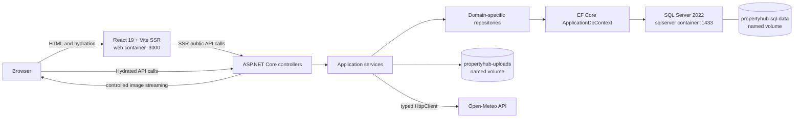

# PropertyHub

[](https://dotnet.microsoft.com/)
[](https://react.dev/)
[](docs/coverage/index.html)
[](docker-compose.yml)
[](#licence-status)

PropertyHub is a locally deployed, multi-user property marketplace for publishing, moderating, and
discovering sale and rental listings. Owners manage their own properties and images, visitors see
only approved and available listings, and Administrators manage Cities, moderation, roles, account
access, and live platform metrics.

The application is built for the Capstone Build Sprint Gate with a .NET 8 Web API, React 19 and
Vite SSR, SQL Server, secure local uploads, Open-Meteo weather, and Docker Compose.

> [!IMPORTANT]
> **Loom submission links are still required.**
>
> - Technical walkthrough, 10–15 minutes: **LOOM_TECHNICAL_URL_PENDING**
> - Non-technical demo, 5–10 minutes: **LOOM_DEMO_URL_PENDING**
>
> Recording scripts: [docs/LOOM_VIDEO_SCRIPTS.md](docs/LOOM_VIDEO_SCRIPTS.md)

## Status and value

| Area | Status | Evidence |
|---|---|---|
| Mandatory application implementation | PASS | Authentication, two CRUD entities, images, weather, Admin area |
| Automated tests and coverage | PASS | 79 backend tests; 91.2% backend line coverage |
| Docker deployment and persistence | PASS | Full rebuild, health, restart, SQL data, and upload persistence UAT |
| Documentation package | PASS | Architecture, ADRs, UAT, AI log, coverage, and recording scripts |
| Recorded Loom videos and final links | BLOCKED | The scripts exist; the videos have not been recorded or linked |

PropertyHub delivers three practical benefits:

- **Visitors** browse a privacy-safe catalogue of approved, available properties and see useful
  current weather for the Property City.
- **Owners** create, edit, soft-delete, mark Sold or Rented, and manage one to five protected
  property images.
- **Administrators** moderate listings, manage Cities and account access, change roles, and inspect
  live SQL-backed metrics.

## Core capabilities

- ASP.NET Core Identity registration and JWT login with `User` and `Admin` roles.
- Database-backed ActiveUser enforcement that immediately invalidates access after role or account
  status changes.
- Full Property and City CRUD through controllers, services, domain-specific repositories, EF
  Core, and SQL Server.
- Separate `ModerationStatus` (`Pending`, `Approved`, `Rejected`) and
  `AvailabilityStatus` (`Available`, `Sold`, `Rented`).
- Owner-scoped Property operations and Admin-only City, moderation, role, status, and metrics APIs.
- Protected local JPEG, PNG, and WebP uploads with MIME, signature, decode, size, dimension,
  ownership, path, and count validation.
- Public React/Vite server rendering and browser hydration for the Property list and detail routes.
- Open-Meteo current conditions using stored City coordinates, a typed `HttpClient`, a five-second
  default timeout, a 30-minute successful-result cache, and graceful failure behavior.
- SQL Server and upload persistence through named Docker volumes.
- Problem Details responses, authentication and upload rate limits, health endpoints, and
  privacy-safe public DTOs.

## Architecture



The required dependency direction is:

```text
React/Vite SSR
    -> ASP.NET Core controllers
        -> application services
            -> domain-specific repository interfaces
                -> EF Core repository implementations
                    -> SQL Server
```

Controllers never access EF Core directly. The API is the only process permitted to access SQL
Server and protected image storage.

More detail:

- [Architecture and request flows](docs/ARCHITECTURE.md)
- [Architecture Decision Records](adr/README.md)
- [ADR-0001: Layered backend architecture](adr/0001-layered-backend-architecture.md)
- [ADR-0002: JWT authorization and immediate invalidation](adr/0002-jwt-authorization-and-token-invalidation.md)
- [ADR-0003: Protected local image storage](adr/0003-protected-local-image-storage.md)
- [ADR-0004: Public-route Vite SSR](adr/0004-public-route-vite-ssr.md)
- [ADR-0005: Resilient Open-Meteo integration](adr/0005-resilient-open-meteo-integration.md)

## Technology stack

Versions come from the checked-in project, package, tool, and container files.

| Area | Technology | Version |
|---|---|---|
| Backend runtime | .NET / ASP.NET Core | 8.0 |
| Authentication | ASP.NET Core Identity and JwtBearer | 8.0.20 |
| Persistence | EF Core SQL Server | 8.0.20 |
| Image validation | SixLabors.ImageSharp | 3.1.12 |
| Frontend | React / React DOM | 19.1.1 |
| SSR server | Express | 5.1.0 |
| Build tooling | Vite / TypeScript | 7.3.6 / 5.9.2 |
| Frontend tests | Vitest / Testing Library | 3.2.7 / 16.3.0 |
| Backend tests | xUnit / Moq / FluentAssertions | 2.9.2 / 4.20.72 / 6.12.2 |
| Coverage | Coverlet collector / ReportGenerator | 6.0.2 / 5.5.11 |
| Database container | Microsoft SQL Server | 2022 latest, Express edition |
| Container runtimes | .NET ASP.NET 8 / Node Alpine | 8.0 / 24 |

## Repository structure

```text
PropertyHub.sln
backend/
  PropertyHub.Api/             HTTP, auth, middleware, health
  PropertyHub.Application/     DTOs, interfaces, services, validation
  PropertyHub.Domain/          entities, enums, roles, exceptions
  PropertyHub.Infrastructure/  EF Core, Identity, repositories, files, Open-Meteo
frontend/propertyhub-web/      React, Vite SSR, hydration, API clients, Vitest tests
tests/
  PropertyHub.UnitTests/
  PropertyHub.IntegrationTests/
adr/                           numbered Architecture Decision Records
docs/                          Gate, scope, coverage, architecture, UAT, scripts
uat-report.md                  assessment-facing UAT summary
ai-collaboration-log.md        exactly 20 reviewed AI interactions
docker-compose.yml
```

## Prerequisites

For the recommended Docker workflow:

- Git
- Docker Desktop with Docker Compose v2
- At least 4 GB of memory available to Docker
- Ports `1433`, `3000`, and `8081` available

For host development and test execution:

- .NET 8 SDK
- Node.js 24 and npm

## Fresh-machine quick start

1. Clone and enter the repository:

   ```powershell
   git clone https://github.com/msami25/PropertyHub.git
   Set-Location PropertyHub
   ```

2. Create the untracked local environment file:

   ```powershell
   Copy-Item .env.example .env
   ```

3. Replace every example credential in `.env`. At minimum, generate new values for:

   - `MSSQL_SA_PASSWORD`
   - the password embedded in `ConnectionStrings__DefaultConnection`
   - `Jwt__SigningKey`, using at least 32 random characters
   - `SeedAdmin__Email`
   - `SeedAdmin__Password`

4. Validate and start the complete stack:

   ```powershell
   docker compose config --quiet
   docker compose up --build
   ```

5. Wait for all three health checks to pass, then open:

   - Web application: <http://localhost:3000>
   - API base URL: <http://localhost:8081>
   - API liveness: <http://localhost:8081/health/live>
   - API readiness: <http://localhost:8081/health/ready>

The API applies EF Core migrations and seeds roles, the configured Admin, and canonical Cities
during startup. Normal restarts preserve SQL data and uploaded files. Do not run
`docker compose down -v` unless an intentional destructive reset is required.

### Stop and restart

```powershell
docker compose down
docker compose up --build
```

`docker compose down` preserves the named volumes. The destructive `-v` option does not.

## Configuration and secrets

| Variable | Purpose |
|---|---|
| `MSSQL_SA_PASSWORD` | SQL Server administrator password |
| `ConnectionStrings__DefaultConnection` | API connection to the `sqlserver` service |
| `Jwt__Issuer` / `Jwt__Audience` | JWT validation boundaries |
| `Jwt__SigningKey` | JWT HMAC signing secret, minimum 32 characters |
| `Jwt__AccessTokenMinutes` | Access-token lifetime; configured as 30 minutes |
| `SeedAdmin__Email` / `SeedAdmin__Password` / `SeedAdmin__FullName` | Local seeded Admin |
| `ImageStorage__RootPath` | Protected upload root inside the API container |
| `OpenMeteo__BaseUrl` | Open-Meteo API root |
| `OpenMeteo__TimeoutSeconds` | Finite provider timeout; default example is 5 |
| `OpenMeteo__CacheMinutes` | Successful-result cache duration; default example is 30 |
| `Cors__AllowedOrigins__0` | Explicit browser origin |
| `API_INTERNAL_BASE_URL` | SSR server-to-API address |
| `VITE_PUBLIC_API_BASE_URL` | Browser-to-API address embedded at frontend build time |

Security rules:

- Never commit `.env`, passwords, connection strings containing real credentials, JWT signing
  keys, or access tokens.
- Do not display seeded Admin credentials in screenshots or recordings.
- Public registration always creates a `User`; it never accepts a role.
- JWTs are kept only in React memory and are not written to local or session storage.
- Replace all `.env.example` values before using the environment beyond disposable local testing.

## Application routes

| Route | Audience |
|---|---|
| `/` and `/properties` | Public server-rendered Property catalogue |
| `/properties/{id}` | Public server-rendered Property detail and weather |
| `/register` | Public account registration |
| `/login` | Public login |
| `/my` and `/my/properties` | Authenticated owner workspace |
| `/admin` and `/admin/users` | Admin metrics and user management |
| `/admin/properties` | Admin moderation |
| `/admin/cities` | Admin City management |

## Testing

### Backend

```powershell
dotnet restore PropertyHub.sln
dotnet build PropertyHub.sln --no-restore
dotnet test PropertyHub.sln --no-build
```

The retained final evidence contains 38 unit tests and 41 integration tests: 79 backend tests.

### Frontend

```powershell
Push-Location frontend/propertyhub-web
npm ci
npm test -- --run
npm run build
Pop-Location
```

The current frontend suite contains 31 Vitest tests. The production command builds both the browser
bundle and the SSR bundle.

### Coverage

```powershell
dotnet tool restore
dotnet test PropertyHub.sln --no-build `
  --settings tests/coverage.runsettings `
  --collect:"XPlat Code Coverage" `
  --results-directory artifacts/coverage
dotnet reportgenerator `
  -reports:"artifacts/coverage/**/coverage.cobertura.xml" `
  -targetdir:"artifacts/coverage-report" `
  -reporttypes:"HtmlSummary;Cobertura;TextSummary"
```

Verified backend line coverage is **91.2%: 2,382 of 2,610 coverable lines**. Generated EF Core
migrations are the only excluded source through `tests/coverage.runsettings`.

Committed evidence:

- [Readable HTML report](docs/coverage/index.html)
- [Cobertura report](docs/coverage/coverage.cobertura.xml)
- [Text summary](docs/coverage/Summary.txt)

## UAT and Docker evidence

The Docker environment has been exercised for registration/login, authorization, City and Property
CRUD, moderation, availability, secure images, weather success/cache/failure, Admin management,
SSR privacy, hydration, health, restart, and persistence.

- [Assessment-facing UAT report](uat-report.md)
- [Detailed execution record](docs/UAT_REPORT.md)
- [Final Gate report](docs/GATE_REPORT.md)
- [Scope cuts](docs/SCOPE_CUTS.md)

The assessment-facing report contains more than ten acceptance tests and distinguishes verified
passes from the narrow-screen responsive check that still needs manual execution.

## AI collaboration

AI assistance was used as a reviewed engineering aid for requirements reconciliation, architecture,
vertical-slice implementation, security analysis, debugging, testing, UAT, UI refinement, and
documentation. Outputs were accepted only after source review and executable verification; some
were modified when initial output or assumptions needed to align with the canonical Gate.

- [AI collaboration log — exactly 20 prompts](ai-collaboration-log.md)
- [Original implementation prompt evidence](docs/AI_PROMPT_LOG.md)

No AI-generated test result, coverage percentage, credential, URL, or UAT pass is claimed without
repository evidence.

## Known limitations and deferred scope

- The Loom recordings and real URLs remain outstanding.
- A real 360-pixel browser viewport UAT pass has not been recorded; responsive CSS, desktop
  overflow, keyboard focus, and component states were verified.
- Authenticated contact reveal, enquiries, MailHog/outbox delivery, favourites, and advanced
  filters remain deferred outside the canonical Gate.
- Access tokens are intentionally short-lived and memory-only; reloading requires login.
- Background deletion of hidden image files is deferred.
- This is a local capstone deployment, not a production cloud configuration.

See [docs/SCOPE_CUTS.md](docs/SCOPE_CUTS.md) for the full rationale.

## Recording and submission

- [Technical and non-technical scripts](docs/LOOM_VIDEO_SCRIPTS.md)
- Technical Loom URL: **LOOM_TECHNICAL_URL_PENDING**
- Non-technical Loom URL: **LOOM_DEMO_URL_PENDING**

Do not replace these placeholders until both recordings meet their required durations and have
been reviewed for exposed credentials, tokens, personal data, terminals, or private browser tabs.

## Licence status

No licence file or explicit software licence is present in this repository. The project must not be
represented as MIT, Apache, GPL, or otherwise open source unless the owner deliberately adds a
licence later. In the absence of a licence grant, normal copyright restrictions apply.
