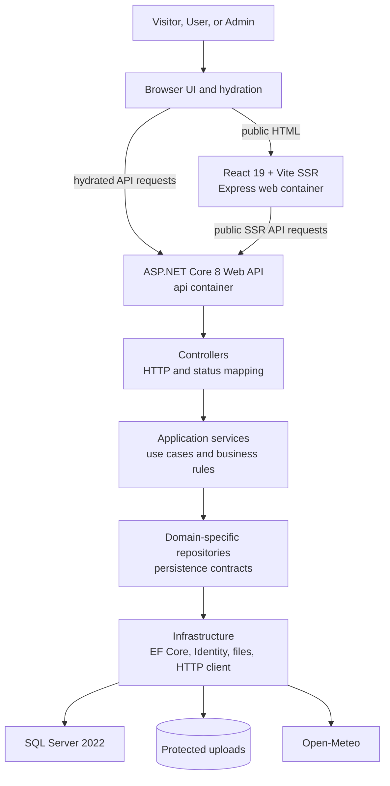
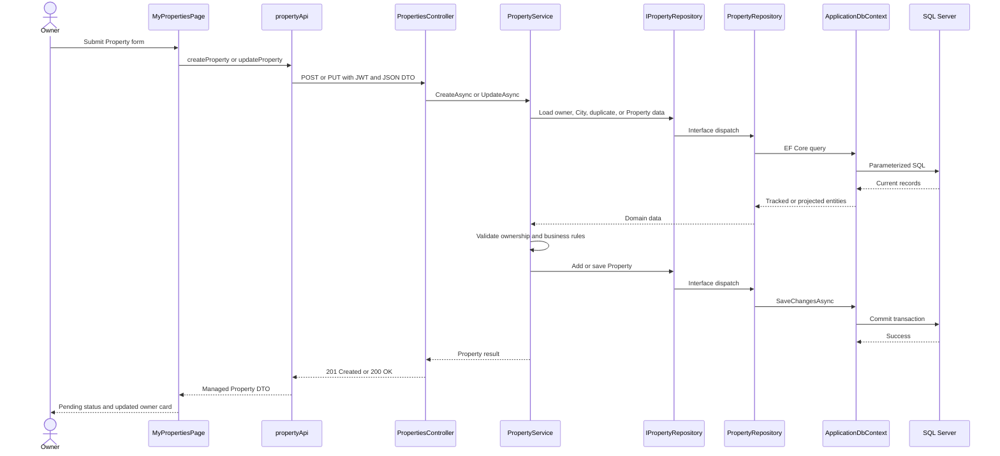
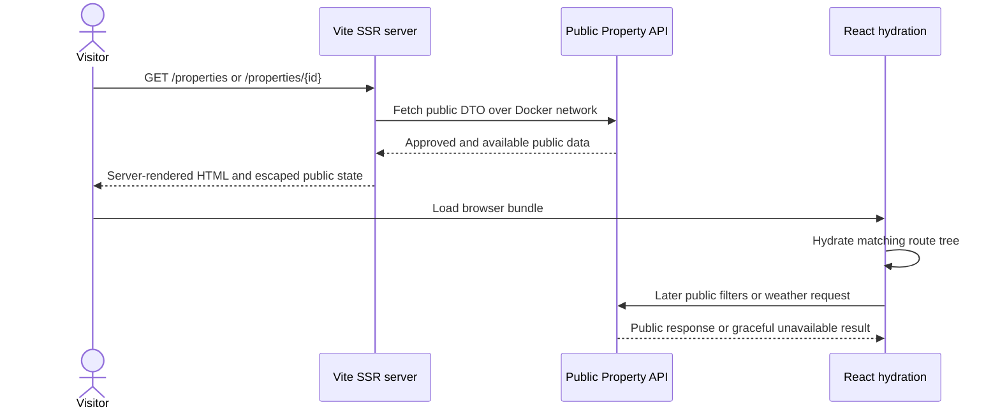
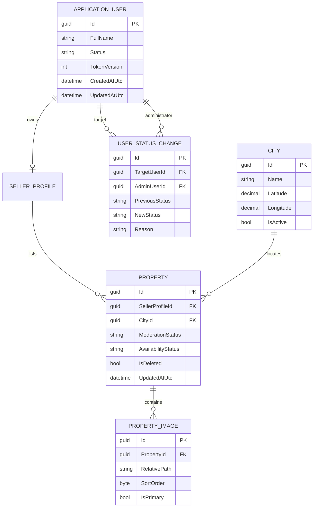
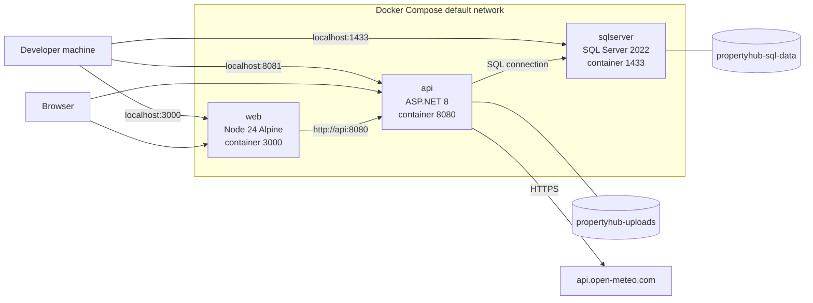

# PropertyHub Architecture

## Purpose

PropertyHub is a local three-container marketplace. React/Vite SSR renders public discovery pages,
the browser hydrates them and drives authenticated workflows, the .NET API owns all business and
security decisions, and SQL Server and protected upload volumes retain state.

The architecture follows the permanent dependency rule:

```text
React/Vite SSR frontend
    -> ASP.NET Core controllers
        -> application services
            -> domain-specific repository interfaces
                -> EF Core repository implementations
                    -> SQL Server
```

## High-level components



### Frontend

- `frontend/propertyhub-web/src/App.tsx` defines the route tree and client navigation.
- Public `/`, `/properties`, and `/properties/{id}` pages receive server-loaded public DTOs and
  hydrate in the browser.
- `/my/properties`, `/admin`, `/admin/properties`, and `/admin/cities` load protected data only
  after an in-memory authenticated session exists.
- Dedicated API modules under `src/api` isolate browser and SSR HTTP concerns.
- React never connects to SQL Server or the upload volume.

### API and application layers

- Controllers accept DTOs, interpret authenticated claims, call services, and map outcomes to
  RESTful HTTP responses and Problem Details.
- Services contain validation, ownership, moderation, availability, account safety, weather, and
  image use cases.
- Repository interfaces are domain-specific: Property, PropertyImage, City, account, and Admin
  user management.
- Infrastructure implements repositories with EF Core and ASP.NET Core Identity.
- `ApplicationDbContext` is the unit of work and applies entity configurations from the
  Infrastructure assembly.

### Cross-cutting infrastructure

- ASP.NET Core Identity hashes passwords and stores roles.
- JWT bearer authentication validates issuer, audience, signature, expiry, and zero clock skew.
- ActiveUser authorization checks account status and token version against SQL Server.
- Global exception handling returns Problem Details without leaking internal paths or stack traces.
- Fixed-window rate limits protect login, registration, and uploads.
- Health checks separate process liveness from SQL-backed readiness.
- `HttpClientFactory`, memory caching, logging, and configuration support Open-Meteo.

## Complete owner Property request flow

This is the implemented React-to-database path for creating or editing a Property.



The controller does not query EF Core. The service enforces server-side authorization and rules;
the repository owns persistence-specific expressions.

## Public SSR and hydration flow



Private routes receive `null` public transfer data. Tokens, contact numbers, owner-only
moderation data, and Admin metrics are never embedded in SSR HTML.

## Data model



`ModerationStatus` and `AvailabilityStatus` are independent. Public queries require `Approved`,
`Available`, not deleted, and an active owner. Owners may mark sale listings `Sold` or rental
listings `Rented`. Material edits and image changes return an approved listing to `Pending`.

## Protected image flow

1. The owner creates a Property and then uploads one to five images to its protected image endpoint.
2. The API verifies ownership and listing state.
3. The validator checks extension, declared MIME type, magic bytes, successful decode, file size,
   dimensions, pixel count, and batch count.
4. The service creates server-controlled names and relative paths.
5. `LocalImageStorage` resolves paths under a configured root and rejects rooted or escaping paths.
6. SQL Server stores metadata; the Docker volume stores bytes outside the web root.
7. Retrieval streams through the API with visibility checks and
   `X-Content-Type-Options: nosniff`.

## Open-Meteo flow

1. The weather service loads a publicly visible Property through `IPropertyRepository`.
2. It passes the Property City ID, latitude, and longitude to the typed weather client.
3. The client checks its City-scoped memory cache.
4. A cache miss calls Open-Meteo with the configured finite timeout.
5. Valid observations are mapped to provider-neutral data and cached for 30 minutes by default.
6. Timeout, network, non-success, malformed, unsupported, or invalid responses become an
   unavailable result; the Property page still renders.

## Docker deployment view



Startup is health-gated: SQL Server becomes healthy before the API starts; API readiness succeeds
before the web service starts. The SQL and upload mounts are named volumes and survive normal
Compose restarts.

## Architecture decisions

- [ADR-0001](../adr/0001-layered-backend-architecture.md): layered controllers, services, and
  domain-specific repositories.
- [ADR-0002](../adr/0002-jwt-authorization-and-token-invalidation.md): Identity, JWT, and immediate
  token invalidation.
- [ADR-0003](../adr/0003-protected-local-image-storage.md): protected local uploads.
- [ADR-0004](../adr/0004-public-route-vite-ssr.md): public-only SSR with client dashboards.
- [ADR-0005](../adr/0005-resilient-open-meteo-integration.md): City-coordinate weather resilience.

## Deliberate boundaries

The canonical Gate took priority over the broader BRD. Contact reveal, enquiries, MailHog/outbox,
favourites, advanced filters, background image cleanup, refresh tokens, and cloud deployment remain
deferred. See [SCOPE_CUTS.md](SCOPE_CUTS.md).
